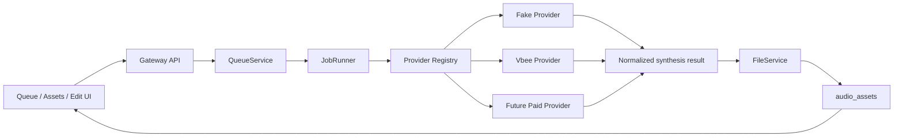

# VoiceFactory Provider Adapter Contract

## Purpose

VoiceFactory is not limited to Vbee. Vbee is the first provider target, while the product architecture must allow additional paid TTS services to be added later.

The core rule:

```text
New TTS provider = new provider adapter, not new job runner logic.
```

## Workflow



## Adapter Boundary

Provider adapters own external TTS details:

```text
auth
voice mapping
provider-specific request payload
browser session or API call
polling/protocol handling
provider errors
temporary audio URL discovery
execution mode handling, such as Vbee preview download vs official download
```

Provider adapters must not own:

```text
SQLite writes
asset insertion
timeline editing
UI behavior
final file naming
direct audio serving
```

## Proposed Contract

```js
class TtsProviderAdapter {
  async synthesize(job, context) {
    return {
      provider: 'provider-name',
      requestId: 'provider-request-id',
      audioUrl: 'https://...',
      localAudioPath: null,
      metadata: {
        voiceCode: job.voice_code,
        executionMode: job.execution_mode,
        format: 'mp3',
        protocolWarnings: []
      }
    };
  }
}
```

For fake/local providers, `audioUrl` may be omitted if the orchestration uses a local generated fixture. Real paid providers should prefer returning a downloadable URL or stream handle that FileService finalizes.

## Provider Documentation Template

Each new provider must include a docs file:

```text
docs/providers/<provider-name>.md
```

Template:

```markdown
# Provider: <Name>

## Auth Method

## Input Limits

## Voice Selection Model

## Rate Limits / Delay Policy

## Output Format

## Download And Finalization Flow

## Error Mapping

## Test Strategy

## Known Account / ToS Constraints
```

## Initial Providers

```text
fake      -> development and tests
vbee      -> first real provider target
future-*  -> paid providers added by adapter contract
```

## Execution Mode Routing

Some providers have multiple valid execution workflows. For Vbee, VoiceFactory currently recognizes two future real-provider modes:

```text
vbee_preview_download   -> use authenticated app/session preview flow and still download the preview audio
vbee_official_download  -> use the normal software generation/download flow
```

A batch may mix modes per item. The queue should persist the chosen mode, and the runner should route to provider handlers by contract.

Detailed Vbee workflow notes live in:

```text
docs/design/07_vbee-dual-execution-workflows.md
```

## Non-Negotiable Rules

- JobRunner must call provider contracts, not provider-specific browser/API code.
- UI must not contain provider credentials or protocol logic.
- Provider adapters must not write SQLite.
- Audio playback must still go through Gateway `/api/audio/:filename`.
- Temporary URLs must be downloaded immediately in the same job execution chain.

## Authentication and Credential Handling (Architecture Notes for Planning)

**Core Principle** (from `.context/modules/TTS_PROVIDER_ADAPTERS.md`, `docs/design/06` and `07`):

Provider-specific credentials (Vbee JWT/accessToken, session logic, etc.) **must not leak** into UI, QueueService, JobRunner, or general browser service.

### Layers and Boundaries (for planning auth/credentials)

1. **Clients (Tauri/Vue UI, ZeroClaw skills)**: 
   - Never see or own any Vbee JWT, token, or credential.
   - Submit only business payload: text/content, voice_code, speed, project, (future) provider + executionMode.
   - Talk to Gateway only via HTTP API (currently completely unauthenticated — local-first).

2. **Gateway Core API + Application**:
   - Public endpoints for now (see `gateway/src/api/routes.js` — no auth middleware, no secrets).
   - `JobRunner` receives the concrete `vbeeAdapter` by constructor injection (see `server.js:24`, `job-runner.js:5`).
   - Only calls the normalized contract: `await vbeeAdapter.synthesize(job)`.
   - Current default (M2): always `FakeVbeeAdapter` (controlled by `config.runtime.vbeeAdapter || 'fake'`).
   - In `/health`: reports `vbeeSession: 'fake' | 'unknown'`, and `providerDegraded = (vbeeAdapter !== 'fake')` (temporary until real adapters can self-report health).

3. **TTS Provider Adapters (the boundary for auth)**:
   - **Own everything external**: auth method, voice mapping, protocol (WS frames, REST), browser session usage, token extraction/echo, error mapping.
   - For Vbee specifically:
     - `vbee_preview_download`: "use authenticated app/session JWT or preview/listen flow".
     - Expected: attach to a browser context that already has a real user login → capture the session bearer from the studio app's own bootstrap `Authorization` headers **inside page JS only** (`addInitScript` + reload) → from `page.evaluate()`, open `wss://vbee.vn/api/v1/synthesis/demo` and send client `INIT` / `SYNTHESIS` frames there. The raw token must not cross into Node, JobRunner, UI, or logs; only `{ audioUrl, requestId, redacted frames }` may return. `GET_REMAINING_PREVIEW` is a post-success quota check, not part of audio delivery (see `preview-recorder.js`). Preview jobs must not type into the Draft.js editor.
     - `vbee_official_download`: reuse authenticated browser session or extract Bearer JWT for official REST endpoints.
   - Return only **normalized** result to FileService (no raw tokens or Vbee details leak upward).
   - "Vbee-specific JWT, preview, browser, and official download steps stay inside Vbee provider adapter code." (07)

4. **BrowserService**:
   - Generic boundary for browser/CDP (M2: only `PlaywrightCdpAdapter` health via `GET /json/version` — no page, no WS, no Vbee).
   - **Must not own** Vbee credentials or protocol logic (BROWSER_SERVICE.md manual).
   - Future: will provide reusable authenticated page/context to Vbee adapters.

5. **Vbee (external)**:
   - Requires the accessToken/JWT per its protocol (observed from DevTools).
   - Tokens are **transient and session-derived** — not a permanent app secret key.
   - The "credential" is the user's real Vbee login state inside the headed browser profile (data/brave-profile or similar). User performs manual login once.

**Current Reality (M2, as of 2026-06-21)**:
- Zero occurrences of `jwt|JWT|accessToken|Bearer|secret|credential` in any `gateway/src/` or `src-tauri/src/` file.
- Everything Vbee-related is behind the pluggable adapter + fake default.
- Protocol harness (`VbeePreviewProtocolRecorder`) validates only the *frame sequence shape* (INIT client/server, SYNTHESIS..., GET_REMAINING_PREVIEW). Real token payloads appear only at runtime in actual browser WS code (to be written in adapter).
- Health explicitly degrades when leaving fake mode (placeholder).

**Out of Scope (per `.context/MILESTONES.md` for M2 and nearby)**:
- Provider account credential storage (encrypted tokens, multi-account management, UI for pasting JWT).
- Auto-refresh of JWT.
- Remote Gateway auth (Tauri ↔ Gateway or multi-user).
- "Ask human before coding if: A live credential, paid provider account... is required." (AGENTS.md).

**Planning Recommendations (M3/M4)**:
- Make adapter swappable via config + registry (M3 goal).
- When real Vbee adapter exists, enhance `/health` and BrowserService health to let the adapter report "vbeeSession: authenticated | needs-login | error".
- Prefer "authMode": "browser-session" (requiresManualLogin: true) for preview flows to keep real fingerprint/stealth. Pure token injection is secondary/optional for CI or specific cases.
- Keep all token/WS/REST Vbee details inside the adapter (or its internal protocol module).
- Document each provider's Auth Method in `docs/providers/vbee.md` (per the template in this file).

This separation is why the architecture can stay provider-agnostic at the core while still supporting the complex Vbee dual workflows (preview vs official) that rely on session JWTs.

See also:
- `.context/modules/TTS_PROVIDER_ADAPTERS.md` (manual section on credentials)
- `docs/design/07_vbee-dual-execution-workflows.md` (full constraints + human pace)
- `docs/milestones/M2_001_browser-cdp-health-and-preview-harness.md` + `M2_002` (current scope of harness)
- `docs/design/02_mvp-architecture.md` (overall layers and injection)
