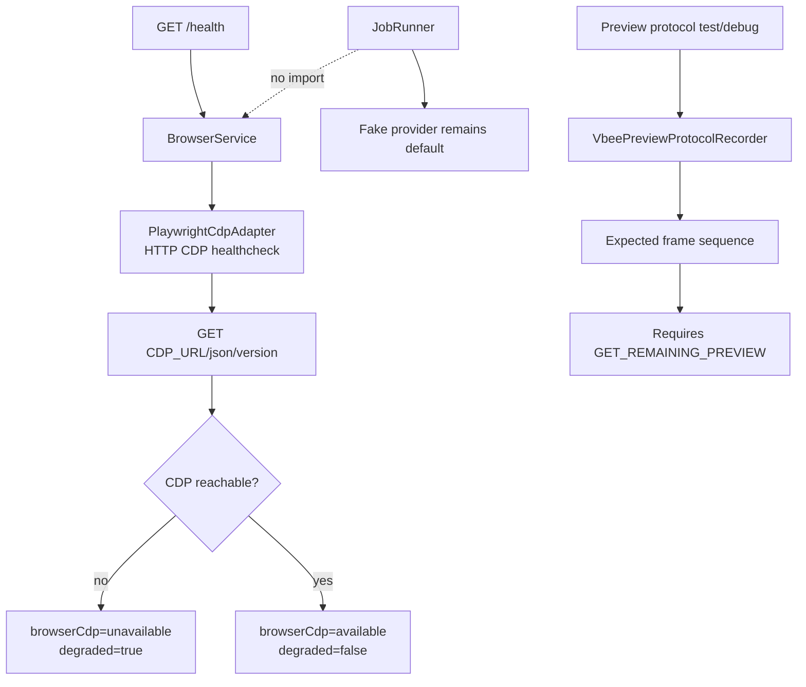

# M2_001 - Browser CDP Health And Preview Harness

Milestone: `M2 - Browser CDP Health And Vbee Preview Harness`

## Workflow



## What Was Implemented

M2 now has a browser boundary and a preview protocol harness without requiring a live browser or Vbee account.

Implemented behavior:

```text
BrowserService wraps browser adapter health
PlaywrightCdpAdapter checks CDP through /json/version
/health includes browser health object
/health returns degraded=true when CDP is unavailable
VbeePreviewProtocolRecorder validates expected preview protocol frames
Fake provider remains the default Gateway worker path
```

Files added or changed:

```text
.context/modules/BROWSER_SERVICE.md
.context/MILESTONES.md
AGENTS.md
gateway/src/infrastructure/browser/browser-service.js
gateway/src/infrastructure/browser/adapters/playwright-cdp.js
gateway/src/infrastructure/browser/browser-service.test.js
gateway/src/vbee/protocol/preview-recorder.js
gateway/src/vbee/protocol/preview-recorder.test.js
gateway/src/server.js
gateway/src/config.js
gateway/src/api/routes.js
package.json
```

## Design Pattern

### Browser Boundary

Browser/CDP details live behind:

```text
BrowserService -> BrowserAdapter
```

The first adapter is named `PlaywrightCdpAdapter` to match the planned browser path, but it only uses the CDP HTTP health endpoint. This avoids adding Playwright or installing browsers during M2 automated tests.

### Degraded Health

Browser CDP failures return health data instead of throwing:

```json
{
  "browserCdp": "unavailable",
  "browser": {
    "status": "unavailable",
    "degraded": true
  },
  "degraded": true
}
```

Gateway remains usable with the fake provider even when CDP is unavailable.

### Preview Protocol Harness

The preview recorder checks the expected future Vbee preview sequence:

```text
server INIT
client INIT
client SYNTHESIS
server SYNTHESIS IN_PROGRESS
server SYNTHESIS SUCCESS
client GET_REMAINING_PREVIEW
server GET_REMAINING_PREVIEW
```

This gives M2 a non-live test path for the WebSocket protocol shape before real Vbee integration.

## Verification

Commands run:

```bash
node --check gateway/src/infrastructure/browser/browser-service.js
node --check gateway/src/infrastructure/browser/adapters/playwright-cdp.js
node --check gateway/src/vbee/protocol/preview-recorder.js
node --check gateway/src/api/routes.js
npm run test:m2
npm run smoke
```

Observed:

```text
5 M2 tests passed
Gateway smoke completed queue -> fake worker -> asset -> audio
/health reported browserCdp=unavailable and degraded=true without crashing
```

## Known Limits

No live browser is launched.

No live Vbee session is touched.

The CDP adapter currently only healthchecks `/json/version`; page automation and network/WebSocket capture are future work.
