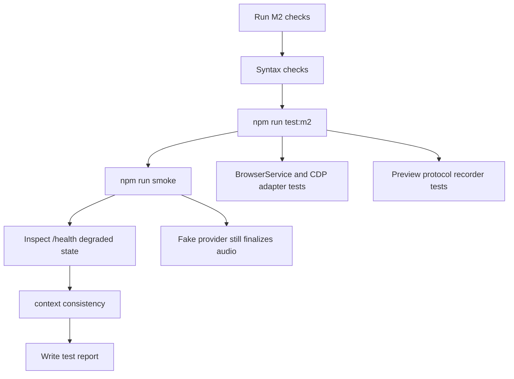

# M2_002 - Browser CDP Health Test Report

Milestone: `M2 - Browser CDP Health And Vbee Preview Harness`

## Workflow



## Test Date

2026-05-26

## Module Under Test

```text
gateway/src/infrastructure/browser/
gateway/src/vbee/protocol/
gateway/src/api/routes.js
gateway/src/server.js
```

## Commands Run

```bash
node --check gateway/src/infrastructure/browser/browser-service.js
node --check gateway/src/infrastructure/browser/adapters/playwright-cdp.js
node --check gateway/src/vbee/protocol/preview-recorder.js
node --check gateway/src/api/routes.js
npm run test:m2
npm run smoke
python3 ../context-mapping/cli.py check-consistency .
```

## Result

PASS.

## Cases Covered

### BrowserService Missing Adapter

Returns:

```json
{
  "status": "unavailable",
  "degraded": true
}
```

### CDP Available

A fake `/json/version` response maps to:

```json
{
  "status": "available",
  "degraded": false,
  "browser": "Chrome/123",
  "protocolVersion": "1.3"
}
```

### CDP Unavailable

Fetch failure maps to unavailable health with an error string instead of throwing.

### Preview Protocol Sequence

The recorder accepts the full expected sequence and detects a missing `GET_REMAINING_PREVIEW` path.

### Gateway Smoke

`npm run smoke` verified:

```text
GET /health
POST /api/queue
fake worker finalization
GET /api/assets
GET /api/audio/:filename
```

Health evidence included:

```json
{
  "browserCdp": "unavailable",
  "degraded": true
}
```

## Residual Risk

No live browser/CDP process was started.

No live Vbee account or session was used.

The recorder validates protocol shape but does not yet capture real WebSocket frames.

## Next Action

Move to M3 provider registry and execution mode routing, or extend M2 manually with live CDP verification if the human wants a browser-backed smoke.
