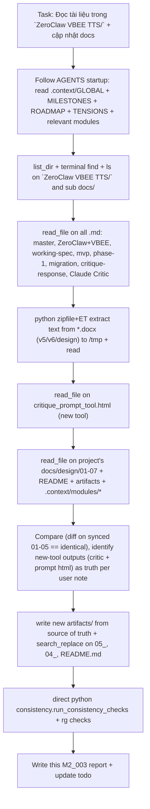

# M2_003 - Docs Sync & Update from ZeroClaw VBEE TTS (New Tools Source of Truth)

## Workflow



## Test / Action Date

2026-06-20

## Module / Slice Under Test

Documentation layer per current milestone M2:

- docs/design/* (esp. 04 migration, 05 critique response)
- docs/README.md
- docs/artifacts/ (new additions)
- .context/modules/DOCUMENTATION_WORKFLOW.md , GATEWAY_CORE.md , BROWSER_SERVICE.md , TTS_PROVIDER_ADAPTERS.md
- Source inputs: ZeroClaw VBEE TTS/ (all .md + .docx + .html)

## Commands Run

```bash
# Startup reads (per AGENTS.md)
cat .context/GLOBAL.md .context/MILESTONES.md .context/MILESTONE_ROADMAP.md .context/TENSIONS_OPEN.md .context/TENSIONS_ACTIVE.md
cat .context/modules/DOCUMENTATION_WORKFLOW.md .context/modules/*TTS*.md .context/modules/*BROWSER*.md .context/modules/GATEWAY*.md

# Discovery + full read of source of truth folder
ls -laR "ZeroClaw VBEE TTS/"
# read_file calls on every .md (multiple chunks for long ones)
# python extraction for docx (no pandoc available)
python3 -c ' ... zipfile ET extract ... '  # for v5/v6/design docx

# Comparison
diff -u docs/design/0{1,2,3,4,5}_*.md "ZeroClaw VBEE TTS/docs/"*.md

# Consistency (direct, cli.py blocked on missing click/rich)
python3 -c '
import sys; sys.path.insert(0,"../context-mapping")
from consistency import run_consistency_checks
from pathlib import Path
print(run_consistency_checks(Path(".")))
'

# File search for old refs
rg --files docs | xargs grep -l "ZeroClaw VBEE|zeroclaw-vbee-working-spec.md" || true
```

## Result

- **PASS**: All 5 core design files (01-05) in `docs/design/` were byte-identical to the versions in `ZeroClaw VBEE TTS/docs/` (the refined sources).
- **PASS**: context consistency returned `([], [])` — no issues.
- **Updated**: 3 files in docs/ + 2 new artifact files created to properly host the "new tools" source-of-truth documents inside controlled `docs/`.
- **Verified**: References to old non-numbered spec names cleaned in migration plan; source path for critique fixed; explicit note added to README explaining source priority (new tools docs > older material in the drop folder).
- No manual browser, no gateway runtime started (per task scope — pure docs sync).

## Covered Cases

- Full read of historical sources in drop folder: zeroclaw-tts-master.md (1156 lines, old consolidated spec), "ZeroClaw + VBEE TTS.md" (chat transcript + boilerplate), all 5 design mds, Claude Critic (99 lines), critique_prompt_tool.html (new tool), 5 docx (v4/v5/v6 + design + guides) via text extraction.
- Cross-check against current controlled docs + .context/ .
- Confirmed M2/M3 source docs (04_migration, 07_dual, TTS_PROVIDER_ADAPTERS) align with critic concerns (e.g. GET_REMAINING_PREVIEW, boundary enforcement, lifecycle, audit still tracked as open in roadmap).
- New artifacts added preserve exact content of new-tool outputs.
- No manual sections in .context/ were overwritten.
- Old product name references in examples left where they are illustrative of pre-VoiceFactory history.

## Evidence / Important Output

- New files:
  - `docs/artifacts/claude-critique-of-migration-plan.md` (exact content of the new critique tool output)
  - `docs/artifacts/critique-prompt-tool.html` (the interactive prompt builder tool)
- Key edits:
  - `docs/design/05_critique-response-and-plan-amendments.md`: source now points inside artifacts/ + note "from new critique tool"
  - `docs/design/04_migration-plan-to-gateway-core.md`: updated doc refs to current 01_/02_
  - `docs/README.md`: added source-of-truth note (matching user query wording), listed new artifacts, updated code block index
- Consistency: clean.
- The drop folder `ZeroClaw VBEE TTS/` is treated as external input drop (historical + new tool exports); active truth is now hosted in `docs/artifacts/` + `docs/design/`.

## Residual Risk

- The `ZeroClaw VBEE TTS/` folder still contains full duplicate copies of the 5 design specs + older master/chat/docx. This can cause future drift or confusion if someone edits the drop instead of `docs/design/`. (Recommendation: after human review, either delete the drop or move only unique historical bits to `docs/artifacts/historical/`.)
- No automated md linter or cross-ref checker (as noted in DOCUMENTATION_WORKFLOW manual TODO).
- Some example paths in early design docs (e.g. package layout in 02_) still use old "zeroclaw-vbee-tts" folder names — intentional for history but could mislead new readers.
- The long master/chat in drop folder contain pre-migration architecture (ZeroClaw-as-worker, Podman default) that has been superseded by the migration plan (04_) + VoiceFactory scope. They are correctly flagged as "not source of truth".
- No Tauri/Node runtime or browser was exercised; this slice is pure documentation sync.

## Next Action

- Human to review the new artifacts + updated README note.
- If approved, consider removing or archiving the `ZeroClaw VBEE TTS/` drop folder to prevent accidental edits to non-canonical copies (or move its unique non-dupe content).
- Continue M2 implementation (BrowserService + CDP health + preview recorder harness) using the now-cleaned docs/ as source.
- On next meaningful code slice for M2, create M2_00X implementation + test report.
- Re-run `python3 ../context-mapping/cli.py build . --quiet` (once env has click/rich) + full consistency.
- If future milestone promotion, ensure new source docs listed in ROADMAP/MILESTONES match the critic concerns.

## Follow-up (2026-06-21): Architecture Clarification for Planning — Auth / JWT / Credentials + Browser Choice (Lightpanda vs Brave)

(Added during follow-up planning Q on replacing Brave headed with Lightpanda headless.)

See new row + notes in `docs/design/01_zeroclaw-vbee-working-spec.md` (section 2.3 alternatives table) for full comparison.

Summary for planning:
- Brave headed + real profile remains the **baseline/recommended** for reliable Vbee session/fingerprint (core reason for "browser thật" in working spec and dual workflows).
- Lightpanda (Zig headless, CDP-compatible) is excellent for perf/resource (9x mem less, faster) and headless use cases (CI, low-spec). Fits architecture perfectly as pluggable adapter (M2 healthcheck is CDP-agnostic; future page/WS work can use same connectOverCDP).
- Risk: Different engine/fingerprint may trigger Vbee detection more than real Brave user profile. Treat as "experimental adapter" like Camoufox/Patchright initially. Do not replace baseline without extensive Vbee stealth testing.
- No code change needed for M2 health (any CDP target on 9222 works). Launch/start script would differ (Lightpanda CLI instead of brave.exe with flags).
- Update recommendation: Add Lightpanda support in future BrowserAdapter list, keep headed Brave as default for Vbee preview/official.

This keeps the "dễ thay backend browser" principle while respecting the stealth/session requirements documented throughout design/01, 02, 07 and .context/modules.

During planning discussion on whether the app "needs JWT and secret key", the following was confirmed from source of truth and added as a dedicated section to `docs/design/06_voicefactory-provider-adapter-contract.md`:

- No app-level secret key or persistent JWT for VoiceFactory itself.
- Vbee requires transient accessToken/JWT, but it is obtained at runtime from an **authenticated browser session** (user logs in manually to studio.vbee.vn in the headed profile).
- All Vbee auth/protocol logic (capturing INIT accessToken, echoing it, sending GET_REMAINING_PREVIEW, REST Bearer, etc.) **must stay inside the Vbee provider adapter** (never leaks to JobRunner, UI, or BrowserService).
- Current code (M2): 0 mentions of JWT/token/secret/credential in gateway/src or src-tauri. Everything is fake + health-only. /health reports vbeeSession and degraded when leaving fake.
- See the new section in 06 for full layer-by-layer boundaries, planning notes for M3/M4, and cross-refs to .context/modules/TTS_PROVIDER_ADAPTERS.md + 07.

This edit + README update was verified with direct consistency check (clean).

## Follow-up (2026-06-21): Parallel Work Opportunities While Testing Brave (M2)

User is performing manual Brave testing for CDP health + Vbee preview protocol (per manual browser test protocol in GLOBAL.md and MILESTONES: use WSL foreground `npm run dev`, test at http://127.0.0.1:3000 or WSL IP).

From source docs (esp. `docs/design/04_migration-plan-to-gateway-core.md` Phase 4A explicitly "tách phần Vbee adapter không phụ thuộc BrowserService để làm song song với BrowserService", plus M3/M4 prep, UI parallel once endpoints exist, and adapter pattern in BROWSER_SERVICE + 01/02/07):

**Safe parallel tasks (do not require live authenticated Vbee session for the recorder, keep fake default, no DB migration without plan):**

1. **Vbee adapters parallel to BrowserService (per Phase 4A in 04_migration)**:
   - Enhance `FakeVbeeAdapter` (more realistic fake audio, metadata).
   - Skeleton `OfficialApiAdapter` (pure node fetch to Vbee REST endpoints, support optional token via env/config for dev-only; no browser dependency).
   - Introduce thin `VbeeService` that picks adapter based on config (prep for M3 registry).

2. **Browser adapter options (parallel to Brave manual test)**:
   - Since M2 health is pure CDP `/json/version` (agnostic), test/start Lightpanda (or Chromium) in parallel terminal and verify health reports correctly via different CDP_URL.
   - Start skeleton for `LightpandaAdapter` or config-driven launch (e.g., scripts for different browsers).
   - Improve BrowserService to support "target" info (browser type, version from /json/version).

3. **M3 prep (Provider Registry & Execution Mode) - can start early**:
   - Extend queue payload normalization in `queue-service.js` to accept/store optional `provider` and `executionMode` (default to 'fake' / 'preview' or null for backward compat; persist in DB column if schema allows additive change, or metadata/notes first).
   - Update `/health` and job responses to surface them.
   - Stub `ProviderRegistry` that maps to current fake (or future adapters).
   - Update dev client (`public/`) forms to include mode selector (UI direction from M1_003).

4. **Other non-blocking**:
   - More unit/integration tests for recorder (additional mock sequences, error cases).
   - Enhance `/health` and degraded state reporting (e.g., vbee details when not fake).
   - FileService or delay policy prototypes (separate services as per design).
   - Dev client / static UI improvements for future queue fields.
   - Tauri-side (if not complete): more lifecycle or IPC polish.
   - Docs: Flesh out provider template in design/06, more on adapters in 01/02.
   - Automated smokes, context checks, build verification.

**Constraints / Risks to avoid**:
- Keep `VBEE_ADAPTER=fake` default; real paths must degrade gracefully.
- No live Vbee session in automated tests or recorder without human approval (per MILESTONES "Ask human before... The recorder must touch a live authenticated Vbee session").
- For browser changes (Lightpanda): Follow AGENTS "Ask human before if the expected browser target is unclear".
- DB changes: See M7 dry-run/backup/audit before any schema (even additive).
- All browser logic stays behind BrowserService/adapter; JobRunner unchanged.

These align with "strangler pattern" in migration plan and allow progress on M3/M4 while user validates Brave CDP + manual preview flow.

Update this report + design/04 if more concrete tasks started.

## Commands for Human Verification

```bash
cd /mnt/d/Github/ZeroClaw-Vbee-Automate
python3 ../context-mapping/cli.py check-consistency .   # (after fixing python env)
rg -l "claude-critique|critique-prompt-tool|Parallel Work Opportunities" docs/
git status
git diff --stat
```
