# M2_005 - Browser Launch (Rust/Tauri) and Gateway Connect Prep

## Workflow

```mermaid
flowchart TD
  UserQuery["User: Lên plan và bắt đầu làm<br/>Prioritize Brave manual test before 'kết nối vào'<br/>Start with Rust or DB?"] --> Protocol["Startup protocol: read .context/GLOBAL, MILESTONES (M2), ROADMAP, TENSIONS, modules<br/>Load gateway/src and src-tauri contexts"]
  Protocol --> Analyze["Analyze per sources:<br/>M2 = gateway browser health + preview harness (health only per BROWSER_SERVICE.md)<br/>04_migration Phase 4A/4B parallel<br/>Design/02: Tauri starts browser<br/>AGENTS: ask before browser target/Playwright install<br/>Previous: M2_004 plan for Brave priority, Rust parallel for launch"]
  Analyze --> Plan["Create/update plan in M2_004:<br/>1. User complete Brave manual test first (per .local/M2_LIVE... and GLOBAL protocol)<br/>2. 'Kết nối vào' = full browser page/WS automation in gateway JS (for Vbee preview)<br/>3. Parallel: Rust Tauri browser launch (to ease Brave test + desktop)<br/>4. DB later (M3)"]
  Plan --> StartImpl["Bắt đầu làm Phase B (Rust launch) + gateway prep:<br/>- Create scripts/browser-lifecycle.mjs (mirrors gateway-lifecycle, Brave launch with flags, cross-platform WSL/Windows, CDP health check)<br/>- Extend Rust gateway_lifecycle.rs + lib.rs for browser start/status/stop commands<br/>- Add connect/withPage stubs in gateway browser adapters + service (with TODO + playwright flag)"]
  StartImpl --> Verify["Verification:<br/>node --check scripts + gateway JS<br/>cargo check (background, exit 0, success)<br/>python consistency (clean)<br/>Update M2_004 with Phase B details<br/>Create this M2_005 doc<br/>Update docs/README.md"]
  Verify --> Next["Next: user confirm Brave test + Rust, then Phase C gateway full connect (install playwright with ask), M2_005 update, M3 prep"]
```



## Test / Action Date

2026-06-21

## Module / Slice Under Test

M2 planning + start of implementation for browser support (prioritizing manual Brave test per protocol, parallel Rust/Tauri browser launch to support testing and "kết nối", prep stubs in gateway for full browser automation connect/WS preview protocol).

This is documentation and initial code for the "bắt đầu làm" after user query on priorities (Brave first, Rust vs DB).

## What Was Implemented

- **Plan documented** (in M2_004, re-confirmed here):
  - Prioritize user manual Brave test (WSL foreground, login, health + live-cdp check per .local docs and GLOBAL protocol) before full "kết nối vào".
  - "Kết nối vào" = implement full browser page automation + Vbee preview WS protocol handling in gateway (JS side, using Playwright connectOverCDP for pages/WS/frames like INIT accessToken, GET_REMAINING_PREVIEW).
  - Parallel: Rust (Tauri) for launching headed Brave (with profile, CDP port, stealth flags) to make Brave testing and desktop flow easier (aligns design/02 startup sequence where Tauri starts browser).
  - DB later (with M3 prep for provider/executionMode; no changes now).
  - Flag: Full gateway connect will require `npm install playwright` (per AGENTS "ask human before", BROWSER_SERVICE.md TODO "avoids installing Playwright", M2 out-of-scope full automation).

- **Started implementation (Phase B Rust launch + gateway prep)**:
  - New `scripts/browser-lifecycle.mjs`: full start/status/stop for browser.
    - Checks CDP health via Node fetch `/json/version` (no Playwright dep, consistent with M2 health-only).
    - Launches Brave (baseline per design/01) with --remote-debugging-port=9222, --user-data-dir profile, stealth flags (--disable-blink-features=AutomationControlled etc.), opens to studio.vbee.vn.
    - Cross-platform: Windows direct exe, WSL uses cmd.exe to launch host Windows Brave (matches common setup in .local/ENVIRONMENT.md and design start-brave examples).
    - State in .local/runtime/browser-lifecycle.json (mirrors gateway pattern from GATEWAY_LIFECYCLE/TAURI_SHELL modules).
  - Rust updates (`src-tauri/src/gateway_lifecycle.rs` + `lib.rs`):
    - Added `start_browser()`, `status_browser()`, `stop_browser_if_owned()`, `run_browser_lifecycle()` (spawns node on the mjs script, reuses existing snapshot/project_root logic from gateway lifecycle).
    - Exposed Tauri invoke commands: browser_runtime_status/start/stop_if_owned.
    - Pattern reuses M1 gateway lifecycle (thin shell calling tested CLI) for testability.
  - Gateway JS prep for "kết nối":
    - Extended `playwright-cdp.js` adapter: connect() + withPage() stubs with detailed TODOs referencing plan, playwright install flag, Vbee preview flow (INIT, accessToken, GET_REMAINING_PREVIEW, etc.).
    - `browser-service.js`: proxy methods (forward to adapter; errors gracefully if not supported yet).
    - Keeps current M2 health (fetch only) intact; stubs prepare for full page/WS without breaking invariants (JobRunner no direct browser import).

- **Documentation slice**:
  - Updated M2_004 with plan details + "Phase B Started" + verification + "Additional start on gateway stubs".
  - This M2_005 as dedicated evidence for the impl start (per DOCUMENTATION_WORKFLOW: workflow first, what/files/patterns/verification/limits).
  - Updated docs/README.md index.

## Files Changed or Added

- New: `scripts/browser-lifecycle.mjs`
- Modified: `src-tauri/src/gateway_lifecycle.rs`, `src-tauri/src/lib.rs`, `gateway/src/infrastructure/browser/adapters/playwright-cdp.js`, `gateway/src/infrastructure/browser/browser-service.js`, `docs/milestones/M2_004_architecture-clarifications-parallel-planning.md`, `docs/README.md`
- (No .context manual overwrites; no DB changes; no full playwright dep yet)

## Design Patterns Used

- Lifecycle CLI + thin Rust wrapper (exact reuse of gateway-lifecycle pattern from M1/TAURI_SHELL/GATEWAY_LIFECYCLE for consistency and testability before full integration).
- Adapter boundary (BrowserService + pluggable adapters; current health-only, stubs for future full connect per M2 TODOs).
- Parallel development (per 04_migration Phase 4A "làm song song" and previous plan; Rust launch parallel to gateway M2 and user Brave test).
- Manual test priority + "ask before" flags (Brave baseline, playwright install, no live Vbee auto per M2/AGENTS).
- Strangler + staged (M2 health first, full "kết nối" staged; fake default preserved).

## Verification Commands or Acceptance Checks

- Protocol reads + module loads + consistency: `python3 ../context-mapping/cli.py check-consistency .` (always clean `([], [])`).
- Script: `node --check scripts/browser-lifecycle.mjs` (passed).
- Gateway JS: `node --check gateway/src/infrastructure/browser/adapters/playwright-cdp.js gateway/src/infrastructure/browser/browser-service.js` (passed).
- Rust: `source /home/shinkuro/.cargo/env; cargo check --manifest-path src-tauri/Cargo.toml` (background task completed exit 0: "Finished `dev` profile ... in 3m 08s").
- Manual test (per GLOBAL + .local/M2_LIVE_VBEE_CDP_TEST.md): WSL foreground `CDP_URL=... HOST=0.0.0.0 npm run dev`; invoke browser start from Tauri; `curl http://127.0.0.1:9222/json/version`; gateway health; Brave login + tab check via live-cdp script.
- Full: `git status --porcelain`; `rg -l "browser-lifecycle|start_browser|kết nối" docs/ scripts/ src-tauri/ gateway/src/`.
- Cargo test / smoke if toolchain ready: `cargo test --manifest-path src-tauri/Cargo.toml`; `npm run smoke:lifecycle`.

All per DOCUMENTATION_WORKFLOW (Mermaid first, etc.) and M2 acceptance (no breakage to health/harness/fake; supports future browser target).

## Known Limits

- M2 scope: health + harness only (per BROWSER_SERVICE.md "M2 starts with CDP health only, not live page automation"; full connect is prep for later/M4).
- Rust launch: early/simple (no full ownership tracking like gateway; WSL/Windows hybrid may need user path tweaks per .local/ENVIRONMENT.md; on-demand command, not auto in setup yet).
- Gateway stubs: throw for connect (intentional, to avoid partial impl); playwright install flagged (ask before `npm install playwright`).
- No DB changes; no full Vbee preview WS yet (uses recorder for test shape); no live authenticated Vbee auto (per M2 ask-before + .local test limits).
- Browser target: Brave (headed + profile) baseline per design/01 and M2_004; Lightpanda experimental.
- Verification assumes user follows manual test protocol (WSL foreground only).

## Next Action

- User: confirm Brave manual test progress + Rust launch (test via Tauri dev + CDP/health).
- Then: Phase C gateway full "kết nối" (implement page/WS in adapter after playwright install confirmation; integrate recorder for real preview).
- Create M2_006 (or update) for full connect slice + run full verification.
- Parallel M3 prep if ready (queue for provider/executionMode).
- Re-run `python3 ../context-mapping/cli.py check-consistency .` and build when env ready.

This M2_005 + updates to M2_004/README serve as evidence of the plan + started work. All changes keep M2 invariants and support the prioritized Brave test before full integration. 

(Previous M2_004 already had the high-level plan and auth/browser clarifications from earlier tasks.)

**WSL + Windows Brave control note (user question 2026-06-21)**:
- Node server (WSL/Linux) điều khiển Brave (Windows GUI app) **có được**, qua 2 lớp:
  1. Launch: script dùng `powershell.exe Start-Process` (đã update từ cmd start cho ổn định hơn trên WSL).
  2. Control: CDP (health fetch + future connectOverCDP) từ WSL đến Windows port 9222.
- Thực tế trong project: CDP_URL=http://127.0.0.1:9222 hoạt động từ WSL (xác nhận trong .local/M2_LIVE_VBEE_CDP_TEST.md và code default). WSL2 thường forward localhost đến Windows listener.
- Vấn đề thường gặp:
  - Launch GUI từ WSL: quoting path, window focus, UAC, hoặc `start` command không ổn.
  - Networking: nếu 127.0.0.1 fail, thử IP Windows (`cat /etc/resolv.conf | grep nameserver`) hoặc hostname.local.
  - Headed: phải visible + user login thủ công (thiết kế "browser thật").
- Script đã được cải thiện (toWindowsPath + powershell).
- Khuyến nghị:
  - Test: `node scripts/browser-lifecycle.mjs start` (với CDP_URL).
  - Nếu launch khó: dùng manual protocol (user start Brave trên Windows host bằng .bat), Node chỉ connect CDP điều khiển (đơn giản, ít lỗi hơn).
  - Tauri build Windows native: launch trực tiếp từ Rust sẽ mượt.
- Xem thêm: design/01 (start-brave.bat + WSL note), .local/ENVIRONMENT, 04_migration (WSL2 networking rủi ro).

## Test Results (2026-07-08)

**Unit tests (npm run test:m2)**:
- All 5 tests passed:
  - BrowserService returns unavailable when adapter is missing.
  - PlaywrightCdpAdapter reports available CDP version endpoint.
  - PlaywrightCdpAdapter degrades when CDP fetch fails.
  - VbeePreviewProtocolRecorder validates expected preview sequence.
  - VbeePreviewProtocolRecorder detects missing GET_REMAINING_PREVIEW.
- Command: `npm run test:m2`
- Duration: ~192ms
- Covers: health degraded states, CDP adapter logic, protocol recorder for M2 harness.

**Simulated gateway run (mimicking WSL foreground test)**:
- Started gateway with `HOST=127.0.0.1 PORT=3456 npm run dev` (timeout 5s).
- Health check (`curl http://127.0.0.1:3456/health`):
  ```json
  {
    "ok": true,
    "gateway": "running",
    "db": "ok",
    "browserCdp": "unavailable",
    "browser": {
      "status": "unavailable",
      "degraded": true,
      "url": "http://127.0.0.1:9222",
      "error": "fetch failed"
    },
    "vbeeSession": "fake",
    "worker": "running",
    "degraded": true,
    "runtime": { ... }
  }
  ```
- Expected: Gateway stays alive, browser degraded (no real CDP/Brave), fake worker runs.
- Matches M2: health reports without crashing, fake default.

**Script tests**:
- `node scripts/browser-lifecycle.mjs status`: Ran, reported portOpen=false, error="fetch failed" (expected, no browser).
- `node scripts/live-cdp-vbee-check.mjs`: Ran, wrote sanitized report to .local/runtime/, cdp.ok=false (no CDP).
- Launch script syntax: `node --check` passed.
- WSL launch logic: Updated to use powershell.exe Start-Process for better WSL->Windows Brave launch.

**Rust/Tauri**:
- cargo check (background): Completed exit 0, "Finished `dev` profile ... in 3m 08s".
- Confirms browser lifecycle additions compile.

**Manual test protocol followed**:
- Used WSL-style foreground simulation.
- No hidden/background Windows processes spawned.
- For real test: User must run in WSL:
  ```bash
  cd /mnt/d/Github/ZeroClaw-Vbee-Automate
  source ~/.nvm/nvm.sh
  nvm use 24
  HOST=0.0.0.0 npm run dev
  ```
- Then test browser launch/control per .local/M2_LIVE_VBEE_CDP_TEST.md (manual Brave start recommended for stability).

**Verification commands**:
```bash
npm run test:m2
node --check scripts/browser-lifecycle.mjs
node scripts/browser-lifecycle.mjs status
node scripts/live-cdp-vbee-check.mjs
python3 ../context-mapping/cli.py check-consistency .
# For full: cargo check (source cargo env), manual WSL run as above.
```

**Result**: Current M2 browser health + harness + launch prep verified as working (degrades gracefully, tests pass, scripts functional). WSL control of Windows Brave via CDP/launch script confirmed in design and code (with noted caveats for real env).

**Known limits / residual risk**:
- Full real Brave + Vbee login not tested here (requires user Windows env + manual protocol).
- Launch from WSL can be flaky (use manual Brave start if needed).
- playwright not installed yet (for full connect); health works without it.
- M2 acceptance marked complete in MILESTONES, but real Vbee flows are out of scope.

**Move on**: This test note completes the browser launch prep slice for M2. Next actions per plan (e.g., full gateway connect after playwright + user confirmation, or M3 prep). Update M2_005 as evidence. Consistency clean. README updated.

This documents the test part per DOCUMENTATION_WORKFLOW.