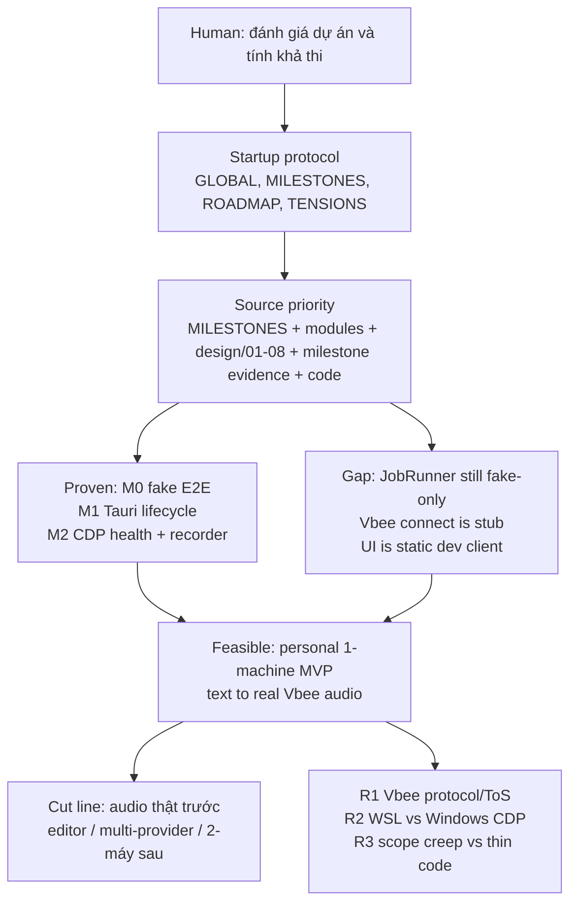

# M2_006 - Project Feasibility Assessment

Milestone: `M2 - Browser CDP Health And Vbee Preview Harness`

Date: 2026-08-12

This is an evaluation of current design sources against code reality. It does not add runtime behavior.

## Workflow



## What Was Assessed

VoiceFactory is a local-first TTS production app. Vbee is the first provider, not the product boundary.

Intended flow:

```text
UI / optional ZeroClaw
  -> Gateway HTTP
    -> Queue + JobRunner
      -> Provider Adapter (fake | vbee preview | vbee official)
        -> FileService (.tmp then finalize)
          -> SQLite audio_assets + /api/audio
```

Verdict:

```text
Làm được — nếu giữ cut line MVP một máy.
Không khả thi nếu ôm editor, multi-provider, ZeroClaw, Podman,
Tailscale/OneDrive, và đóng gói bán cùng lúc trước khi có audio Vbee thật.
```

This matches the MVP cut line in `.context/MILESTONE_ROADMAP.md` and the PM order in `docs/design/08_usable-build-and-distributed-deployment.md`: real voice on one machine first.

## Proven Versus Code Reality

| Layer | Status | Evidence |
|---|---|---|
| Queue → fake audio → HTTP play | Working | M0 docs, `JobRunner` + `FileService.createFakeAsset` |
| `/health` + SQLite WAL + worker | Working | M0/M2 routes and health payload |
| Tauri start/reuse/stop Gateway | Working | M1 lifecycle CLI + Rust shell |
| CDP health degrades, does not crash | Working | `PlaywrightCdpAdapter.healthcheck`, M2 tests |
| Preview recorder including `GET_REMAINING_PREVIEW` | Harness only | `preview-recorder.js` |
| Brave/CDP launch script | Working | `scripts/browser-lifecycle.mjs` |
| Playwright `connect()` / `withPage()` | Stub / prep | Adapter exists; not the live Vbee job path |
| Provider registry + executionMode | Not implemented | M3 backlog |
| Real Vbee preview/official download | Not implemented | M4 backlog; design/07 still open on selectors/JWT |
| Desktop Vue UI / Sound Editor | Not implemented | `public/` is a static dev client |
| ZeroClaw / Podman | Optional, out of MVP | GLOBAL invariants |

`JobRunner` still calls the fake adapter directly. That is acceptable for M0–M2. It is the first thing that must change before a real Vbee job can ride the same runner.

## Feasibility By Target

| Target | Feasibility | Note |
|---|---|---|
| Personal fake queue + playback | Already done | Not an open question |
| Real Vbee audio, 1 account, manual login | High | Correct next product slice |
| Mixed `vbee_preview_download` + `vbee_official_download` | Doable after one live path works | Shared account throttle required |
| Human-pace delay | Doable | Engineering, not an unknown |
| Usable Queue/Assets UI, Edit placeholder | High | Do not build a DAW |
| Packaged Tauri for the author's machine | Medium | Node sidecar + Brave + profile |
| Multi-provider marketplace | Low if started now | Keep the contract; implement later |
| Sound Editor timeline | Not MVP | Explicit out of scope through M2 |
| Two machines + Tailscale + OneDrive | After one-machine real audio | design/08 Phase D/E |

## Design Pattern

The assessment used the project source priority, not memory:

```text
1. Latest human instruction
2. .context/MILESTONES.md
3. .context/MILESTONE_ROADMAP.md
4. .context/modules/*.md [manual]
5. docs/design/*.md
6. docs/milestones/*.md
7. Code reality
```

Architecture that remains valid:

```text
Gateway is the only SQLite writer
JobRunner must not import browser/filesystem/SQLite directly
Providers sit behind adapters
Fake adapter stays the default test path
Browser/Vbee failure degrades health
Presigned/temporary URLs must download in the same job chain
```

## Risks That Can Still Kill The Slice

1. **Vbee protocol is observed, not contracted.** JWT extraction, DOM selectors, and network interception are still open in design/07. Missing `GET_REMAINING_PREVIEW` can mark a session abnormal. Presigned URL TTL is short.
2. **Account / ToS.** Headed session automation is technically feasible and still an account risk. One session, human pace, no overlapping browser actions.
3. **WSL to Windows Brave CDP.** `127.0.0.1:9222` often fails across the VM boundary. Production MVP should run Gateway on the same machine as Brave.
4. **Docs heavier than code.** Roadmap M0–M10 plus extra browser adapters will stall the only valuable milestone: a real audio file.

## Recommended Cut Line

Keep this as the definition of "done enough":

```text
App opens
Gateway starts or reuses correctly
Brave CDP health is available or clearly degraded
User logs into Vbee once by hand
Text enters the queue
One real provider path produces audio
FileService finalizes the asset
UI plays it through Gateway HTTP
Fake path remains for development
ZeroClaw and Podman stay optional
```

Do next:

```text
Phase C / live connectOverCDP and download in the same job
M3-sized registry: provider + executionMode, JobRunner routes by contract
One Vbee mode working before the second mode
Queue/Assets UI only
```

Do not do until a real Vbee file exists:

```text
Camoufox / Lightpanda / Patchright
Sound Editor
Required ZeroClaw
Podman default
Tailscale / OneDrive
Additional paid providers
Architecture-only refactors of the already-proven fake path
```

Conditions the human owns:

```text
A live Vbee session for protocol capture
Gateway and Brave on the same OS/network
Scope stays at one-machine real audio
```

Effort band if those conditions hold: weeks to about two months for one working Vbee path. M0–M2 already answered "does the skeleton run?".

## Files Changed Or Added

```text
docs/milestones/M2_006_project-feasibility-assessment.md
docs/README.md
docs/PROJECT_OVERVIEW.md
```

No Gateway, Tauri, or runtime code changed.

## Verification Commands Or Acceptance Checks

This slice is documentation only. Commands below confirm the sources still match the assessment; they do not re-run a live Vbee job.

```bash
cd /mnt/d/Github/ZeroClaw-Vbee-Automate
python3 ../context-mapping/cli.py check-consistency .
ls -1 docs/milestones/M2_*.md
```

Code facts cited in the assessment (read, not changed):

```text
gateway/src/application/job-runner.js          # fake adapter only
gateway/src/infrastructure/browser/adapters/playwright-cdp.js
gateway/src/vbee/protocol/preview-recorder.js
gateway/src/infrastructure/files/file-service.js
public/index.html                              # static dev client
.context/MILESTONES.md                         # current = M2
.context/MILESTONE_ROADMAP.md                  # M3-M10 backlog + MVP cut line
docs/design/07_vbee-dual-execution-workflows.md
docs/design/08_usable-build-and-distributed-deployment.md
```

## Known Limits

- This document is an assessment, not an implementation plan to execute.
- It does not promote M3 or change `.context/MILESTONES.md`.
- Live Vbee feasibility remains high-confidence, not proven. No new live CDP or login test was run for this slice.
- Playwright is already listed in `package.json` from earlier Phase C prep; this assessment does not install or invoke it.
- Root `README.md` still describes the project as M0 in places. That stale line is outside this slice.

## Next Action

Human accepts or rejects the cut line. If accepted, the next coding slice is one-machine real Vbee audio (Phase C), not editor/provider/distribution work.
