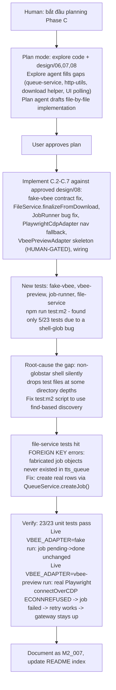

# M2_007 - Phase C: Real Vbee Adapter Wiring (Code-Only Slice)

Milestone: `M2 - Browser CDP Health And Vbee Preview Harness` (continues into Phase C per `docs/design/08`)

Date: 2026-09-03

## Workflow



## Module / Slice Under Test

Turns the already-approved `docs/design/08_usable-build-and-distributed-deployment.md` Phase C spec (subsections C.1-C.8) into working code. This is the **code-only** portion of Phase C: everything that can be implemented and verified without a live, human-supervised Vbee session. The actual Vbee DOM selectors, session-token detection, and audio-capture method are intentionally left unresolved (see "Known Limits").

## What Was Implemented

- **`FakeVbeeAdapter` contract fix** (`gateway/src/vbee/adapters/fake-vbee.js`): now returns the normalized shape from design/06 (`provider`, `requestId`, `audioUrl: null`, `localAudioPath: null`, `metadata`). Previously returned an ad-hoc `{adapter, requestId, metadata}` shape that nothing actually consumed correctly.
- **`FileService.finalizeFromDownload(job, result)`** (`gateway/src/infrastructure/files/file-service.js`): new method alongside the untouched `createFakeAsset`. Fetches `result.audioUrl` (injectable `fetchImpl`, defaults to global `fetch`) or copies `result.localAudioPath`, writes to `.tmp` then renames, then the same `BEGIN IMMEDIATE` transaction pattern (`audio_assets` insert, `tts_queue` update, `tts_log` insert) as `createFakeAsset`. Extension resolution precedence: `metadata.format` → URL/path extension → default `.mp3`. Real assets store `duration_ms`/`sample_rate`/`channels` as `null` (no audio-decoding dependency added).
- **`JobRunner.tick()` bug fix** (`gateway/src/application/job-runner.js`): now consumes the adapter's result and branches on its shape (`audioUrl || localAudioPath` present → `finalizeFromDownload`, else → `createFakeAsset`), never on provider name; also marks the job `failed` on error. See "Bugs Found And Fixed" #1 for what was broken and why.
- **`PlaywrightCdpAdapter.withPage()` navigation fallback** (`gateway/src/infrastructure/browser/adapters/playwright-cdp.js`): when Brave has no existing page (a fresh blank tab), navigates to `https://studio.vbee.vn` before handing the page to the caller. `connect()` and `healthcheck()` untouched.
- **`VbeePreviewAdapter` skeleton** (new file, `gateway/src/vbee/adapters/vbee-preview.js`): constructor-injects `browserService` (never imported directly by JobRunner). Orchestration flow (`ensureStudioPage` → `extractSessionToken` → `locateEditor` → `injectPreviewText` → delay → `triggerPreview` → `capturePreviewAudioUrl` → map to normalized result) is real and tested. Every step that requires unknown Vbee-specific selectors/tokens/capture-method defaults to a function that throws a clear `HUMAN-GATED: ...` error naming exactly what's unresolved, rather than guessing. All six steps are constructor-injectable so the orchestration logic itself is unit-testable today without faking Vbee's DOM. Reuses `VbeePreviewProtocolRecorder` (already implemented in M2) as the place real captured WS frames get recorded once a live session resolves the open questions.
- **Wiring**: `gateway/src/server.js` now picks the adapter via `config.runtime.vbeeAdapter` (`'vbee-preview'` → `VbeePreviewAdapter`, anything else → `FakeVbeeAdapter`, matching the codebase's permissive-default style — a typo doesn't crash Gateway). `gateway/src/api/routes.js`'s `/health` now reports `vbeeSession: 'browser-session'` for `vbee-preview` instead of the previous generic `'unknown'`. `gateway/src/config.js` documents the new `VBEE_ADAPTER` value in a comment.
- **`npm run test:m2` script fix** (`package.json`): now enumerates test files via `find` instead of a shell glob. See "Bugs Found And Fixed" #2.
- **Tests** (all new, `node:test` + `node:assert/strict`, constructor-injection convention, no mocking library — matches existing tests): `fake-vbee.test.js`, `vbee-preview.test.js`, `job-runner.test.js`, `file-service.test.js`. See "Verification" for counts.

## Bugs Found And Fixed

### 1. JobRunner discarded the adapter's result and never marked jobs failed (production bug, pre-existing)

**Where:** `gateway/src/application/job-runner.js`, `tick()`.

**Bug:** `await this.vbeeAdapter.synthesize(job)` was called but its return value was never used — the code unconditionally called `fileService.createFakeAsset(job)` afterward regardless of which adapter ran. A real Vbee adapter's actual synthesis result would always be thrown away and silently replaced with a fake silent WAV. Separately, the `catch` block only logged the error to console and never called `queueService.markStatus(job.id, 'failed', ...)`, so a job that threw during synthesis stayed stuck at its last status (`downloading`) forever. Since `retryJob()` only matches `status IN ('failed', 'failed_file_lock', 'cancelled')`, a stuck job could never be retried through the existing `/api/jobs/:id/retry` endpoint — it was permanently wedged.

**How found:** Surfaced while reading `job-runner.js` against `docs/design/08` C.5 during Phase C planning, which named this exact bug as something to fix.

**Fix:** Branch on the result's shape (`result.audioUrl || result.localAudioPath`) to choose `finalizeFromDownload` vs `createFakeAsset`; mark the job `failed` with the error message in `catch`.

**Evidence:** `job-runner.test.js` Tests C/D (adapter rejects → `failed`; `finalizeFromDownload` rejects → `failed`). Live run: a real `vbee-preview` failure (no Brave running) reached `status: 'failed'` with the actual Playwright error text in `notes`, and `POST /api/jobs/:id/retry` successfully reset it to `pending` with `retry_count: 1`.

### 2. `npm run test:m2` silently dropped test files (pre-existing, latent — unmasked by this session's new tests)

**Where:** `package.json`, `"test:m2": "node --test gateway/src/**/*.test.js"`.

**Bug:** The shell that runs npm scripts here (WSL Debian, non-interactive) does not have bash `globstar` enabled, so `**` behaves like a single `*` and does not cross `/`. Every test file that existed before this session lived two directory levels under `gateway/src/` (`infrastructure/browser/`, `vbee/protocol/`), so the shell glob matched **zero** files. Bash's default (no `nullglob`) is to leave an unmatched glob as the literal string, so the literal pattern `gateway/src/**/*.test.js` got passed straight to `node --test`, which has its own correctly-recursive glob and picked up both files anyway — accidentally working and hiding the bug entirely.

**How found:** Adding `gateway/src/application/job-runner.test.js` (one directory level deep) gave the shell's glob exactly one real match. The shell expanded the argument to that single resolved file path before Node ever saw a pattern, bypassing Node's recursive glob. `npm run test:m2` silently reported "5 tests, 5 pass" — the same numbers as before any of this session's new tests existed — with no error or warning that 4 of 5 new test files never ran at all.

**Fix:** Changed the script to `node --test $(find gateway/src -name '*.test.js')` — enumerates recursively via `find` (POSIX, works under dash and bash alike) instead of depending on shell glob semantics.

**Evidence:** `npm run test:m2` reported 5 tests before the fix, 23 after — same command, matching every `*.test.js` file actually on disk.

### 3. This session's own `file-service.test.js` first draft violated a foreign key (caught before landing, never shipped)

**Where:** test-only, `gateway/src/infrastructure/files/file-service.test.js`.

**Bug:** `audio_assets.source_job_id` is declared `REFERENCES tts_queue(id)`, and Node's `node:sqlite` enforces foreign keys by default. The first draft of this test called `finalizeFromDownload(job, result)` / `createFakeAsset(job)` with a plain fabricated `job` object that was never inserted into `tts_queue` — a state that can't occur in production, since `JobRunner` only ever operates on jobs returned by `queueService.pickPendingJob()`, which reads real, already-persisted rows. All 5 tests that touched the database failed with `FOREIGN KEY constraint failed`.

**How found:** Immediately, from the first real `npm run test:m2` run after writing the test (once bug #2 above was also fixed and all files actually executed).

**Fix:** Rewrote the test setup to create jobs through the real `QueueService.createJob()` against the same in-memory DB, so a genuine `tts_queue` row exists before `FileService` is exercised — matching how the method is actually invoked in production. (The one test that deliberately forces a DB failure — the rollback test — still needs an invalid `content: null`; it gets a valid job from `createJob()` first, then passes a shallow copy with `content` overridden, so the FK is satisfied while the intended `NOT NULL` violation still triggers.)

**Evidence:** All 7 `file-service.test.js` tests pass after the fix.

## Files Changed or Added

- Modified: `gateway/src/vbee/adapters/fake-vbee.js`, `gateway/src/infrastructure/files/file-service.js`, `gateway/src/application/job-runner.js`, `gateway/src/infrastructure/browser/adapters/playwright-cdp.js`, `gateway/src/server.js`, `gateway/src/api/routes.js`, `gateway/src/config.js`, `package.json` (`test:m2` script)
- New: `gateway/src/vbee/adapters/vbee-preview.js`, `gateway/src/vbee/adapters/fake-vbee.test.js`, `gateway/src/vbee/adapters/vbee-preview.test.js`, `gateway/src/application/job-runner.test.js`, `gateway/src/infrastructure/files/file-service.test.js`

## Design Patterns Used

- Adapter boundary + normalized result contract (design/06) — JobRunner branches only on result shape, never provider name.
- Constructor injection for testability (`fetchImpl` on `FileService`/`PlaywrightCdpAdapter`, per-step injection on `VbeePreviewAdapter`) — same convention already used by `PlaywrightCdpAdapter.healthcheck`'s `fetchImpl`.
- Explicit HUMAN-GATED skeleton: real orchestration structure, unresolved external unknowns throw a named, greppable error instead of a guessed implementation.
- Strangler pattern continuation: fake path untouched and still the default; real path added alongside, selected by config.

## Verification Commands or Acceptance Checks

```bash
# WSL Debian (node/npm not on Windows PATH in this environment)
source ~/.nvm/nvm.sh && nvm use 24
npm run test:m2
```

Result: **23/23 tests pass** (was 5 before this slice: 3 `BrowserService`/`PlaywrightCdpAdapter` + 2 `VbeePreviewProtocolRecorder`; now also 2 `FakeVbeeAdapter`, 4 `VbeePreviewAdapter`, 5 `JobRunner`, 7 `FileService`, 2 pre-existing unchanged).

Live regression checks (real `npm run dev`, real HTTP, no mocks):

- `VBEE_ADAPTER=fake` (default): queued job goes `pending -> done`, asset has `notes: "Fake adapter generated silent WAV asset"`, `duration_ms: 1000`, `.wav` — byte-identical to pre-Phase-C behavior. `/health` reports `vbeeSession: "fake"`.
- `VBEE_ADAPTER=vbee-preview` with no Brave/CDP running: `/health` reports `vbeeSession: "browser-session"`. Queued job goes `pending -> submitting -> failed` with the **real** Playwright error in `notes` (`browserType.connectOverCDP: connect ECONNREFUSED 127.0.0.1:9222`). Gateway stays up (`/health` still 200 after the failure). `POST /api/jobs/:id/retry` resets the job to `pending` with `retry_count: 1`. This exercises the real `connect()` path (not a stub) end-to-end, one layer short of `VbeePreviewAdapter`'s HUMAN-GATED steps (never reached, since there's no CDP endpoint to connect to).

## Known Limits

- **`VbeePreviewAdapter`'s core steps are intentionally unimplemented.** `extractSessionToken`, `locateEditor`, `injectPreviewText`, `triggerPreview`, and `capturePreviewAudioUrl` all throw `HUMAN-GATED: ...` errors. Per `docs/design/08` these require a live session: the user logs into Brave with a real Vbee session while observing real DOM/network traffic (`scripts/live-cdp-vbee-check.mjs` + CDP) to determine the actual selectors, the session/login signal, and whether the preview audio URL surfaces via HTTP response or a WS frame (and whether it's independently fetchable or needs the browser's session cookies, which decides `audioUrl` vs `localAudioPath` in the adapter's return value — both already supported by `FileService.finalizeFromDownload`). This is the necessary next step, not part of this slice.
- `PREVIEW_ACTION_DELAY_MS = 6000` is a placeholder per design/07's "action 4-10s random" note. The full human-pace scheduler (typing/review WPM formula) is milestone M5, not built here.
- No test added for `PlaywrightCdpAdapter.withPage()`'s navigation fallback or for the `server.js`/`routes.js` wiring lines — no existing mock seam for real Playwright/`connectOverCDP`, and building one risked encoding guesses unrelated to the fix. Verified instead via the live regression run above (real `connectOverCDP` attempt, real error propagation).
- Real downloaded assets store `duration_ms`/`sample_rate`/`channels` as `null` (no audio-decoding dependency added). `public/app.js`'s `formatDuration(null)` currently renders `"0.0s"` rather than `"-"` for these — a pre-existing minor UI quirk this slice exposes but does not fix (UI changes are out of scope for Phase C per design/08; only Phase D's D.3 touches `public/app.js`).
- The file-write-before-DB-transaction ordering in `finalizeFromDownload` (same as the pre-existing `createFakeAsset`) means a DB failure can leave an orphaned file on disk. Already tracked under milestone M6 (File Service Hardening); not fixed here.

## Next Action

Schedule the live Vbee discovery session with the user: log into Brave with a real Vbee session, observe real DOM/network/WS traffic via `scripts/live-cdp-vbee-check.mjs` + CDP, and fill in `VbeePreviewAdapter`'s five HUMAN-GATED step functions. Once resolved, run the full `VBEE_ADAPTER=vbee-preview` live acceptance flow from `docs/design/08` C.8 (`POST /api/queue` -> real `.mp3` in `data/audio/` -> playable in Assets).
