# M2_008 - Phase C: Live Vbee Session - HUMAN-GATED Steps Resolved

Milestone: `M2 - Browser CDP Health And Vbee Preview Harness` (continues Phase C from M2_007)

Date: 2026-09-09

## Workflow

```mermaid
flowchart TD
  Start["User logged into Vbee on their everyday Brave"] --> CdpGap["Brave had no --remote-debugging-port open\nRelaunched on the user's real profile (reuses login)"]
  CdpGap --> LockFight["Chromium single-instance-per-profile lock:\na second plain Brave launch briefly stole the debug flag\nFixed by killing all brave.exe then launching exactly once"]
  LockFight --> WslGap["node/Playwright (WSL) cannot reach\nWindows-side 127.0.0.1:9222 - separate infra gap, deferred"]
  WslGap --> ConsoleDiscovery["Pivoted to DevTools Console paste-and-copy()\ninstead of Playwright, for this one-time discovery"]
  ConsoleDiscovery --> DomFound["DOM snapshot: Draft.js editor, #try-listening,\n#convert-tts - real selectors"]
  DomFound --> TokenLeak["Network-capture script v1 blindly sliced(0,200)\nof every WS frame -> partial JWT + username leaked\ninto chat twice before script was fixed to redact"]
  TokenLeak --> WsProtocol["v2 (token-redacted) capture: full WS protocol observed -\naudio_link ships inside the SYNTHESIS SUCCESS frame itself,\nGET_REMAINING_PREVIEW is an unrelated quota check"]
  WsProtocol --> Implement["Implement all 5 HUMAN-GATED steps for real;\nfix capturePreviewAudioUrl ordering (arm before click);\nadd redactSensitiveFields; correct recorder's expected sequence"]
  Implement --> Tests["31/31 unit tests (up from 23) via fake\nPlaywright Page/Locator/WebSocket stubs"]
  Tests --> Doc["Document as M2_008"]
```



## Module / Slice Under Test

M2_007 shipped `VbeePreviewAdapter` as a skeleton: real orchestration, but all five Vbee-specific steps threw `HUMAN-GATED` errors because the actual selectors, session signal, and audio-capture method were unknown. This slice resolves all five, using evidence gathered from a live, human-supervised session against the user's own logged-in `studio.vbee.vn` account, per the process `docs/design/08` C.4 called for.

## What Was Implemented

- **`extractSessionToken`** (`gateway/src/vbee/adapters/vbee-preview.js`): checks the page isn't redirected to `auth.vbee.vn/login` and that `#try-listening` exists. It does **not** read any token/cookie value — live evidence showed Vbee's session cookie is httpOnly (absent from `document.cookie`, `localStorage`, `sessionStorage`), so page-JS-based code structurally cannot read it even if it tried.
- **`locateEditor`**: `page.locator('#editor-wrapper [contenteditable="true"]')`, waits for visible. The editor is a **Draft.js** rich-text component, not a plain textarea.
- **`injectPreviewText`**: clicks the editor, `Ctrl+A`/`Delete` to clear, then `pressSequentially(content, {delay: 20})` — real keystroke events. Draft.js keeps its own `EditorState` mirroring the DOM; setting `textContent`/`value` directly is ignored or reverted, only real input events are observed by its change handlers.
- **`triggerPreview`**: clicks `#try-listening` ("Nghe thử").
- **`capturePreviewAudioUrl`**: listens on `page.on('websocket', ...)` for the connection matching `/synthesis\/demo/`, records `framesent`/`framereceived` frames, and resolves as soon as a server frame has `type: 'SYNTHESIS'` and `result.status === 'SUCCESS'` with `result.audio_link` — that URL is the answer; there is no separate HTTP fetch or `GET_REMAINING_PREVIEW` round-trip involved. **Ordering fix:** `#runPreviewFlow` now invokes (arms) `capturePreviewAudioUrl` *before* awaiting `triggerPreview`'s click, not after — the WebSocket opens as a side effect of that click, so a listener attached afterward could miss it entirely. Calling an async function starts it synchronously up to its first `await`, so arming happens in time without needing to restructure the step contract.
- **`redactSensitiveFields`** (new, exported for testing): every client frame on the synthesis WebSocket carries a plaintext `accessToken` field (confirmed live, twice). Client frames are redacted (`/token|auth|secret|password/i` on key names, recursive) before ever reaching `VbeePreviewProtocolRecorder`, so even an in-memory `recorder.snapshot()` dump can't surface it — defense in depth beyond "the recorder is never logged."
- **`EXPECTED_PREVIEW_SEQUENCE` correction** (`gateway/src/vbee/protocol/preview-recorder.js`): two fixes from live evidence. (1) The client sends `INIT` first (carrying the token); the server's `INIT` is the ack, not an unprompted hello — the original list had this backwards. (2) `GET_REMAINING_PREVIEW` removed from the expected sequence entirely: it's a leftover-quota check the UI fires *after* the audio link already arrived, unrelated to audio delivery, and `capturePreviewAudioUrl` stops listening the moment it has that link — so those frames are never observed by design, and requiring them would flag every successful run as "incomplete."

## Bugs Found And Fixed

### 1. Discovery tooling leaked a fragment of the user's real Vbee session token into chat (process bug, caught and fixed mid-session)

**Where:** a scratch PowerShell/DevTools-console script used only for this live discovery session (not committed to the repo) — not `vbee-preview.js` itself.

**Bug:** The first WebSocket-capture script handed to the user did `data.slice(0, 200)` on every frame's raw text to build a "preview" field, with no check for whether the frame contained sensitive fields. The client `INIT` frame (and every subsequent client frame) carries `accessToken` as its first/second JSON key, so the 200-character slice captured the JWT header, subject UUID, and full username/email in cleartext. The user pasted this output into chat twice (a second, unrelated capture script was layered on top without reloading the page first, so the old unredacted hook fired again alongside the new one).

**How found:** Visible immediately in the pasted output — not caught proactively before asking the user to run it.

**Fix:** Rewrote the capture script to JSON-parse each frame and recursively redact any key matching `/token|auth|secret|jwt|cookie|password/i` to `'[REDACTED]'` before ever producing output, with no length truncation needed once redacted. Applied the same principle to production code: `redactSensitiveFields()` in `vbee-preview.js` does the equivalent for real captured frames before they reach the protocol recorder.

**Consequence and remediation:** What leaked was a partial (likely-incomplete, missing the signature segment) JWT plus the account's username/email, inside a private conversation — not posted publicly. The user was informed directly and offered the option to rotate the session (log out/in on Vbee) at their discretion; this is not something the assistant can do on the user's behalf.

**Evidence:** `redactSensitiveFields replaces token-shaped fields at any depth without touching the rest` (`vbee-preview.test.js`) exercises the same redaction logic now used for real captured frames.

### 2. `capturePreviewAudioUrl` would have missed its own WebSocket if built in the original skeleton's step order

**Where:** `gateway/src/vbee/adapters/vbee-preview.js`, `#runPreviewFlow`.

**Bug:** The M2_007 skeleton called `await this.steps.triggerPreview(page)` and only then `await this.steps.capturePreviewAudioUrl(page, recorder)`. Live traffic showed the preview WebSocket connection opens as a direct side effect of the click. A `page.on('websocket', ...)` listener registered after the click had already returned could attach after the connection (and its `INIT`/`SYNTHESIS` frames) had already fired, silently missing the one frame the whole function exists to find.

**How found:** Reasoned from the observed event timing while designing `capturePreviewAudioUrl`, before writing any test against it — not caught by a failing test, since the original skeleton had no real implementation to expose the race.

**Fix:** Arm `capturePreviewAudioUrl` (call it, without awaiting yet) immediately before `await`-ing `triggerPreview`'s click, then await the capture promise separately. Documented inline with the non-obvious reason (async functions run synchronously up to their first `await`, so this ordering is sufficient without restructuring the step contract).

**Evidence:** `default capturePreviewAudioUrl resolves with audio_link from the SYNTHESIS SUCCESS frame` arms a fake page's websocket listener and only then emits frames — mirrors the real timing dependency.

### 3. `preview-recorder.js`'s expected sequence didn't match observed reality (speculative, corrected by live evidence)

**Where:** `gateway/src/vbee/protocol/preview-recorder.js`, `EXPECTED_PREVIEW_SEQUENCE`.

**Bug:** Written in M2 before any live traffic was available, it assumed (a) the server sends an unprompted `INIT` before the client's, and (b) `GET_REMAINING_PREVIEW` is part of the core synthesis sequence. Two independent live captures (a first, accidentally-unredacted one and a second, clean one) both showed the client's `INIT` — carrying the token — comes first, and `GET_REMAINING_PREVIEW` is a decorative quota check that fires after audio delivery and is never observed by `capturePreviewAudioUrl` (see bug #2's fix — it stops listening once it has `audio_link`).

**How found:** A new test (`default capturePreviewAudioUrl resolves with audio_link...`) failed with `missing client INIT` on the first run, because the cursor-based sequence matcher in `verifyExpectedPreviewSequence()` requires frames in the exact listed order and the client `INIT` frame (recorded first) was being searched for only *after* the server `INIT` match had already advanced the cursor past it.

**Fix:** Swapped the first two entries to `client INIT` then `server INIT`; removed both `GET_REMAINING_PREVIEW` entries. Updated `preview-recorder.test.js`'s "detects missing" case to match against a missing `SYNTHESIS SUCCESS` frame instead (the `GET_REMAINING_PREVIEW` case it previously tested no longer applies).

**Evidence:** All `preview-recorder.test.js` and `vbee-preview.test.js` tests pass with the corrected sequence.

## Files Changed or Added

- Modified: `gateway/src/vbee/adapters/vbee-preview.js` (all 5 default steps implemented, `redactSensitiveFields` added and exported, `#runPreviewFlow` reordered), `gateway/src/vbee/protocol/preview-recorder.js` (`EXPECTED_PREVIEW_SEQUENCE` corrected), `gateway/src/vbee/protocol/preview-recorder.test.js` (one test updated to match)
- Rewritten: `gateway/src/vbee/adapters/vbee-preview.test.js` (7 new/changed tests against fake Playwright Page/Locator/WebSocket stubs, replacing the old "still HUMAN-GATED" placeholder test)

## Design Patterns Used

- Evidence-before-code: every selector, event ordering, and protocol assumption below was taken from real captured traffic, not guessed — matching the M2_007 plan's explicit refusal to guess Vbee-specific unknowns.
- Constructor-injection testability preserved: all five steps remain independently swappable: the new tests fake Playwright's `Page`/`Locator`/`WebSocket` event-emitter surface rather than requiring a real browser, consistent with this repo's existing convention.
- Defense in depth on credentials: httpOnly cookie (Vbee's own doing) plus explicit field-level redaction in this codebase (`redactSensitiveFields`), rather than relying on a single layer.
- Arm-before-trigger ordering for event-driven capture, documented inline since the reason (JS async execution semantics) is non-obvious from the code alone.

## Verification Commands or Acceptance Checks

```bash
# WSL Debian (node/npm not on Windows PATH in this environment)
source ~/.nvm/nvm.sh && nvm use 24
npm run test:m2
```

Result: **31/31 tests pass** (was 23 after M2_007; +6 new `VbeePreviewAdapter` step tests, +2 `capturePreviewAudioUrl`/redaction tests, 1 `preview-recorder` test changed, net +8 minus 1 removed placeholder).

Live verification performed this slice: DOM structure and the full WebSocket protocol (both request and response frames, redacted) were observed against the user's real, logged-in `studio.vbee.vn` session via DevTools Console. Additionally, `VbeePreviewAdapter` was run for real (not simulated) via Windows-native Node + Playwright (`D:\Programs\vbee-cdp-driver`, an isolated folder outside the repo - see "Known Limits" for why) against real Brave: `ensureStudioPage` → `extractSessionToken` → `locateEditor` → `injectPreviewText` all ran and were confirmed correct by screenshot (the injected text appeared correctly in the real Draft.js editor) and `triggerPreview`'s selector correctly resolved the real button. What was **not** confirmed: a full click-to-`audio_link` round trip - see the rate-limit finding below.

## Known Limits

- **The final click-to-`audio_link` round trip is still unconfirmed - blocked by what looks like a free-preview rate limit, not a code defect.** After DOM interaction was confirmed working (see above), `#try-listening` was found genuinely `disabled` (real HTML attribute + `Mui-disabled` class, confirmed via `outerHTML` and a screenshot) and stayed disabled through Playwright's full 30s retry window. The account's paid-credit balance is enormous (13.6M+ points shown in the UI) and `Tạo audio` (the paid path) sits right next to it fully enabled, ruling out a general quota problem. The earlier captured `remaining_preview: -1584` (deeply negative) points at a **free-preview-specific** limit, separate from paid credits, most likely exhausted by this session's own repeated manual testing (the account's conversion history shows several prior test runs from today). `capturePreviewAudioUrl`'s WS-parsing logic itself is not in question here - it was built directly from two independent real captures of a full successful round trip; the only thing not yet re-confirmed is that `VbeePreviewAdapter.synthesize()` observes the same thing when it's the one doing the clicking. Retrying once the rate limit resets (duration unknown - likely hourly or daily) is the natural next check.
  **Correction (see M2_009):** this rate-limit hypothesis was disproven by further live diagnostics. Seven distinct programmatic text-injection methods were tried against the real editor and all failed identically (zero network requests fired, `#try-listening` stayed disabled, the save indicator stuck on "Đang lưu..."), while the user's own manual typing in the same session, same account, fired real network requests twice - ruling out a rate limit (which would block manual input too) in favor of Vbee's own change-detection/autosave logic simply not firing for programmatic DOM mutation, by any method tried. See `docs/milestones/M2_009_dom-automation-blocked-pivot-to-direct-api.md` for the full diagnostic sequence and the resulting pivot toward calling the synthesis WebSocket directly.
- **WSL cannot reach Windows' CDP port - resolved for now by running Windows-native, not by changing the gap itself.** WSL2-on-Windows-10 does not forward Windows' `127.0.0.1` (confirmed: `curl` succeeds from Windows, times out from WSL), and Brave was confirmed to silently ignore `--remote-debugging-address` set to anything other than its default loopback (tested both a specific WSL-facing interface IP and, before being blocked from testing further, `0.0.0.0` was ruled out as an option by the user on security grounds) - so widening the bind is not viable with this Brave build either way. The working fix: Node/Playwright now also runs natively on Windows, in an **isolated folder outside the repo** (`D:\Programs\vbee-cdp-driver`, `playwright` only, `PLAYWRIGHT_SKIP_BROWSER_DOWNLOAD=1`, ~18MB) rather than the project's own `node_modules` - sharing one `node_modules` between a Windows-native and a WSL-native `npm install` risks corrupting `@tauri-apps/cli`'s platform-specific optional dependency for whichever environment installs second. This means: **the actual Gateway (JobRunner + HTTP routes + SQLite), when it needs to drive real Brave, currently needs to run on Windows-native Node, not WSL** - WSL remains fine for everything that doesn't touch `PlaywrightCdpAdapter.connect()`. Not yet decided whether that split is the long-term shape or a stopgap.
- **`audio_link` fetchability from Node is assumed, not proven.** The captured URL (`https://vbee-studio2-3.s3.ap-southeast-1.amazonaws.com/...`) had no visible query string in either capture, suggesting a plain public-read S3 object that `FileService.finalizeFromDownload`'s cookie-less `fetch()` should handle — but this has not actually been tried. If it turns out to require the browser's session, the fallback (download via the page context and return `localAudioPath` instead of `audioUrl`) is already supported by the adapter contract and `FileService`, just not implemented.
- **Selectors/protocol are a snapshot of 2026-09-09.** If Vbee changes their studio UI or WS protocol, nothing in this codebase will detect the drift automatically (this was a manual DevTools session, not a scripted contract test against the live site) — it would resurface as `HUMAN-GATED`-style runtime failures or silent mismatches, not a build-time signal.
- `PREVIEW_ACTION_DELAY_MS = 6000` remains an untuned placeholder (unchanged from M2_007) — real UI timing tolerance wasn't specifically tested this slice.

## Next Action

Once the free-preview rate limit resets, re-run `D:\Programs\vbee-cdp-driver\run-adapter.mjs` (or the real Gateway with `VBEE_ADAPTER=vbee-preview`, run natively on Windows per the note above) to confirm the click-to-`audio_link` round trip for real, then complete the `docs/design/08` C.8 acceptance flow end-to-end: `POST /api/queue` -> real `.mp3` finalized into `data/audio/` -> confirm `finalizeFromDownload`'s cookie-less fetch actually works against the S3 `audio_link`. Separately, decide whether the Windows-native-for-CDP / WSL-for-everything-else split is the intended long-term shape.
