# M2_009 - Phase C: DOM Automation Blocked - Diagnostics And Pivot To Direct API

Milestone: `M2 - Browser CDP Health And Vbee Preview Harness` (continues Phase C from M2_008)

Date: 2026-09-09

## Workflow

```mermaid
flowchart TD
  Start["M2_008 Known Limits: click-to-audio_link blocked,\nhypothesized free-preview rate limit"] --> Retry["Baseline keystroke method retried live:\nDOM text correct, button stays disabled,\nzero network requests fire"]
  Retry --> RateOut["Button had briefly been enabled earlier\nwith no code/account change -> rules out\na simple sustained rate-limit gate"]
  RateOut --> Variants["6 more injection methods tried:\nno-delete retype, clipboard paste, execCommand,\nraw CDP Input.insertText (x2), single-char append"]
  Variants --> AllFail["Every method fails identically:\nDOM updates, network silent,\n'Đang lưu...' stuck, button disabled"]
  AllFail --> SideChecks["Side diagnostics rule out selection-only,\nfocus/visibility state, and typing speed\nas the differentiator"]
  SideChecks --> ManualWorks["Key evidence: user's own manual typing,\nsame session/page/account,\nfired real network requests twice"]
  ManualWorks --> Correction["Corrected conclusion: Vbee's own\nchange-detection/autosave doesn't fire for\nANY programmatic DOM mutation - not a rate limit"]
  Correction --> Pivot["User authorizes pivot (2 decision points):\ncall the synthesis WebSocket directly\ninstead of driving the UI"]
  Pivot --> Invariant["Revisits design/06's credential invariant -\na direct call needs the real bearer token"]
  Invariant --> TokenDesign["Design: confine token to browser\npage-context only - addInitScript() captures it,\npage.evaluate() runs the whole WS round trip"]
  TokenDesign --> TokenConfirmed["find-token-source.mjs confirms token is present\non ordinary authenticated calls\n(length/prefix-only logged, never full value)"]
  TokenConfirmed --> Prototype["test-direct-api.mjs written:\nfull INIT/SYNTHESIS round trip\ninside page.evaluate()"]
  Prototype --> Blocked["Execution blocked by Claude Code's\nsafety classifier (live creds, live network) -\nnot retried or routed around"]
  Blocked --> Doc["Document as M2_009;\ncorrect M2_008's rate-limit theory"]
```

## Module / Slice Under Test

M2_008 left one thing unconfirmed: the final click-to-`audio_link` round trip, with a working hypothesis that `#try-listening` was disabled by a free-preview rate limit rather than a code defect. This slice is the live diagnostic follow-up — using the Windows-native driver at `D:\Programs\vbee-cdp-driver` (kept outside the repo; see M2_008 "Known Limits" for why) against the same real, logged-in `studio.vbee.vn` session — that actually tested that hypothesis. It didn't hold up. This doc records the diagnostic sequence that disproved it, the corrected conclusion, and the resulting design pivot toward calling Vbee's synthesis WebSocket directly instead of driving the UI — a pivot that is designed and prototyped, but explicitly **not yet verified**.

No `gateway/` source changed this slice. This is a documentation-only pass over already-completed live diagnostic and design work; nothing was executed as part of producing this doc.

## Diagnostic Sequence: What Each Method Tested And Ruled Out

All scripts below live at `D:\Programs\vbee-cdp-driver\<file>.mjs`, connect over CDP to the same real, already-logged-in Brave session used in M2_008, and target the same real selectors (`#editor-wrapper [contenteditable="true"]`, `#try-listening`) resolved in that slice. None are part of this repo's git history.

**Baseline / infrastructure (carried over from M2_008, re-used as the entry point for every run this slice):**

- `connect-test.mjs` — confirms the CDP connection is alive and lists open contexts/pages.
- `check-session.mjs` — navigates to the studio URL and confirms `#try-listening` is present (signed-in signal).
- `run-adapter.mjs` — runs the real `VbeePreviewAdapter.synthesize()` (imported directly from `gateway/src/vbee/adapters/vbee-preview.js`) against the live page, i.e. the production `injectPreviewText`/`triggerPreview` code path itself, not a standalone probe.

**Seven distinct programmatic text-injection methods tried, all against the same real editor and button:**

1. **Keystroke typing (baseline)** — click, `Control+A`, `Delete`, `pressSequentially(content, {delay: 20})`. This is `VbeePreviewAdapter`'s actual `defaultInjectPreviewText` method. Exercised via `run-adapter.mjs` (the real adapter) and, with full WebSocket/network instrumentation layered on, via `debug-flow.mjs`, `check-save-state.mjs`, `check-save-network.mjs`, and `test-foreground.mjs`.
2. **Select-all + type-over, no explicit `Delete`** — `test-retype-variants.mjs`. Rules out the separate delete step as the culprit (e.g. a framework treating delete-then-insert as two distinct, individually-uncommitted mutations).
3. **Clipboard paste** — `test-paste.mjs`: grants clipboard permissions, `navigator.clipboard.writeText()`, then `Control+V`. Rules out that keystroke-shaped events specifically were required, and that the browser's native paste path fares any differently.
4. **`document.execCommand('insertText', …)`** — `test-execcommand.mjs`. Rules out that the browser's own native rich-text editing command (the path many contenteditable frameworks hook via `beforeinput`) is treated differently from raw key events.
5. **Raw CDP `Input.insertText` (v1)** — `test-cdp-inserttext.mjs`: opens a `context.newCDPSession(page)` and sends `Input.insertText` directly, bypassing Playwright's higher-level keyboard API entirely. Rules out that something about Playwright's own automation layer — as opposed to the resulting DOM events — was the tell.
6. **Raw CDP `Input.insertText` (v2)** — `test-cdp-inserttext-v2.mjs`: same call, with an explicit `editor.focus()` and small waits added around select/delete/insert. Rules out a focus/timing race as the reason v1 failed.
7. **Tiny single-character append** — `test-tiny-append.mjs`: clicks to the end of existing settled text and types **one character** with no select-all and no delete at all — the smallest possible change. Rules out that the bulk delete-then-retype pattern itself resembles a bot/bulk-paste signature large enough to be specifically distrusted.

Typing speed was also varied incidentally across these (20ms/keystroke in the baseline and most variants vs 50ms in the tiny-append case) with no difference in outcome, ruling that out too.

**Every one of the seven methods failed identically**: the visible DOM text updated correctly in most cases, but the app fired **zero non-asset network requests**, `#try-listening` **stayed disabled** through Playwright's full retry window, and a "Đang lưu..." (saving) indicator got **permanently stuck** instead of settling to "Đã lưu" (saved).

**Supporting diagnostics (narrowed the search space further, without being injection methods themselves):**

- `test-selection.mjs` — `Control+A` select with **no typing at all**. Confirms mere selection/focus doesn't move the button; button state tracks content changes specifically, not selection or focus events.
- `test-foreground.mjs` — explicit `page.bringToFront()` plus `document.visibilityState`/`document.hasFocus()` checks before typing. Rules out a backgrounded/blurred automation tab as the explanation.
- `check-save-state.mjs` — polls the "Đang lưu.../Đã lưu" save-indicator text alongside button-enabled state once per second for 10s. This is where the "stuck on 'Đang lưu...'" observation comes from directly.
- `check-save-network.mjs` — instruments `request`/`requestfailed`/`response` page events (filtered to non-GET, non-`.js`/`.css`) during and after typing. This is the direct evidence for "the app fired zero network requests" in response to programmatic input.
- `inspect-button.mjs` — inspects the button's `outerHTML`/`Mui-disabled` class and nearby DOM text for quota/cooldown messaging, plus a screenshot. This is the script M2_008 originally used to confirm the button was genuinely (attribute-level) disabled, not just visually greyed out; it remained part of the toolkit for this slice's runs.

## Key Evidence: Manual Typing Works, Automation Doesn't

The single most important data point from this session: **the user's own manual typing into the same Draft.js editor, earlier in the same live session, triggered real network requests — captured twice.** Same account, same login, same browser tab, same page, same editor.

That contrast is what rules out a global account- or app-level explanation. If the app itself, or the account, were rate-limited or broken, manual input would fail too — it didn't. The problem is narrower and more specific than that: it is about *how automation drives input into the editor*, not about the account, the app being down, or a quota being exhausted.

## Corrected Conclusion

M2_008's "Known Limits" recorded a working hypothesis: `#try-listening` looked disabled because of a free-preview rate limit (pointing at a captured `remaining_preview: -1584` and the account's history of repeated test runs that day). That hypothesis does not survive this session's evidence:

- The button had briefly been seen **enabled** earlier in this same investigation, with no code or account change in between — inconsistent with a simple, sustained rate-limit gate.
- All seven tried injection methods — several of which (raw CDP `Input.insertText`, the single-character append) look nothing like a bulk bot-paste pattern a naive rate-limiter or anti-automation heuristic might key on — produced the identical failure signature.
- Manual typing, in the same account and session, worked. A rate limit would gate the account/feature regardless of whether the input came from a human or a script; this one apparently doesn't.

**Corrected working theory:** Vbee's studio app has its own client-side change-detection/autosave mechanism — whatever internally marks the document "dirty" and enables `#try-listening` — that does not fire in response to *any* of the programmatic DOM mutation paths tried, even though the Draft.js editor itself accepts and renders the text correctly in every case. This looks like an automation-detection-shaped or event-plumbing-shaped gap specific to Vbee's frontend, not a quota or rate-limit issue.

This is a correction, not a certainty: see "Known Limits" below for what remains unproven about even this corrected theory.

**Correction (see M2_010):** this theory was also wrong. The real mechanism is much simpler than either the original rate-limit guess or this change-detection theory: `#try-listening` is gated on the editor having an active **text selection**, not on detecting an edit at all. None of the seven methods above included a post-injection selection step (`test-selection.mjs` tested selection alone, on *unchanged* text, and correctly found that insufficient - but the missing case, selection *after* injecting new content, was never isolated). Adding one `Control+A` before the click - matching the user's own screenshot observation from earlier in this investigation - made every one of the "automation-resistant" methods above work. See `docs/milestones/M2_010_selection-gated-preview-confirmed-real-e2e-audio.md` for the live confirmation, the shipped fix, and a real end-to-end Gateway run producing real Vbee audio. The direct-API pivot designed below is consequently no longer motivated, though it remains available if DOM automation breaks again for some other reason.

## Direct-API Pivot: Design And Rationale

With the DOM route dead-ended for now, the user explicitly authorized — across two separate decision points in the live session (first choosing to try more DOM approaches, then, after those also failed, explicitly choosing to pivot) — exploring calling Vbee's synthesis WebSocket API directly instead of continuing to drive the UI.

This required revisiting `docs/design/06_voicefactory-provider-adapter-contract.md`'s "Authentication and Credential Handling" section, whose core principle is: "Provider-specific credentials (Vbee JWT/accessToken, session logic, etc.) **must not leak** into UI, QueueService, JobRunner, or general browser service," and whose adapter contract says the adapter must "Return only **normalized** result to FileService (no raw tokens or Vbee details leak upward)." A direct WebSocket call needs the real bearer token to send in the `INIT`/`SYNTHESIS` frames — unlike the preview-click flow, where the token is something the browser attaches on the app's behalf and `VbeePreviewAdapter` never has to touch.

**The design settled on and prototyped:** capture and use the token entirely within the browser's own page-execution context, never in Node.

- `page.addInitScript()` hooks `window.fetch` to capture the `Authorization` header from an already-firing **normal page request** (the app's own bootstrap calls) into a page-scoped `window.__vbeeToken` variable. `addInitScript` must be registered before navigation so the hook is in place before those bootstrap calls fire — this is why the prototype does a fresh `page.goto(STUDIO_URL, { waitUntil: 'networkidle' })` rather than reusing the already-open tab.
- The token is **never logged, never read into Node**. Every value that crosses back from `page.evaluate()` to the driving script is a safe, non-secret field.
- `page.evaluate()` runs the **entire** WebSocket `INIT`/`SYNTHESIS` round trip inside the browser — same origin, same session, same `WebSocket` object the real app would use — resolving only `{ audioUrl, requestId, frameLog }` back to Node.

This is a real deviation from design/06's original framing, not a loophole around it: the raw token is now read and used by JavaScript, which it wasn't before in this adapter. What is preserved is the boundary that mattered most in design/06's own language — the token still never appears in Gateway, JobRunner, UI, repository source, or any log; it now lives and dies entirely inside the browser's own page-context execution, the same trust boundary the user's authenticated session already lives in. Whether this satisfies the invariant's intent, or needs the design doc itself updated to describe it, is flagged below rather than decided here.

## `find-token-source.mjs` Confirmation

Before writing the full prototype, `find-token-source.mjs` checked feasibility: it hooks both `window.fetch` and `XMLHttpRequest.prototype.setRequestHeader` via `addInitScript()`, watching for any outgoing header key matching `/auth/i`, and records only `{ url, key, length, prefix: <first 15 chars> }` into `window.__authHeadersSeen` — never the full value. That sanitized array is the only thing read back via `page.evaluate()`.

Confirmed live: an `Authorization: Bearer <token>` header is present on ordinary authenticated page-load calls — `/api/v1/auths/verify`, `/api/v1/me` — proving the token is obtainable from normal app traffic the browser already generates on page load, without needing to trigger the broken editor change-detection path at all.

## `test-direct-api.mjs` Status: Built, Not Verified

`test-direct-api.mjs` is the full prototype, narrower and more targeted than `find-token-source.mjs`: its `addInitScript` hook matches only the `Authorization` header specifically (`/^authorization$/i`) and stores the bearer value (token only, `Bearer ` prefix stripped) into `window.__vbeeToken`. After confirming (boolean only) that a token was captured, it runs a `page.evaluate()` that opens `wss://vbee.vn/api/v1/synthesis/demo`, sends `{ type: 'INIT', accessToken }` on open, sends `{ type: 'SYNTHESIS', accessToken, payload: {...} }` once the server acks `INIT` with `status: 1`, and resolves `{ audioUrl, requestId, frameLog }` when a `SYNTHESIS` frame arrives with `result.status === 'SUCCESS'` and `result.audio_link`. This mirrors the exact protocol shape already confirmed live and implemented in M2_008's `capturePreviewAudioUrl`/`redactSensitiveFields` — it drives a already-understood protocol from a different execution context, it does not guess at a new one.

**Status: this script has not been executed or verified.** The one attempt to run it (`node test-direct-api.mjs`, against the live CDP session) was intercepted by Claude Code's own safety classifier — correctly, since it is a live network action using live, real credentials against the user's real account — and was **not retried or routed around**. The user was told what the script does and asked how they'd like to proceed, and has not yet decided. Nothing in this document should be read as claiming the direct-API approach works end to end; it is an unverified prototype pending a user decision.

## Files Changed Or Added

- Added: `docs/milestones/M2_009_dom-automation-blocked-pivot-to-direct-api.md` (this file).
- Modified: `docs/milestones/M2_008_phase-c-live-vbee-session-human-gated-resolution.md` (correction note appended to the rate-limit "Known Limits" bullet, pointing here), `docs/README.md` (milestone index entry added).
- No `gateway/`, `src-tauri/`, or other repository source changed this slice.
- Not part of this repo (referenced only): the 17 scripts at `D:\Programs\vbee-cdp-driver\*.mjs` listed in "Diagnostic Sequence" above — `connect-test.mjs`, `check-session.mjs`, `run-adapter.mjs`, `debug-flow.mjs`, `inspect-button.mjs`, `test-selection.mjs`, `test-retype-variants.mjs`, `check-save-state.mjs`, `check-save-network.mjs`, `test-paste.mjs`, `test-foreground.mjs`, `test-execcommand.mjs`, `test-cdp-inserttext.mjs`, `test-cdp-inserttext-v2.mjs`, `test-tiny-append.mjs`, `find-token-source.mjs`, `test-direct-api.mjs`.

## Design Patterns Used

- **Elimination by variation**: hold the target action constant (insert text, then observe button state and network traffic) while varying only the injection mechanism across seven methods, isolating the input-method dimension from timing, focus, and account-state dimensions.
- **Evidence-before-theory** (continued from M2_008's "evidence-before-code"): the rate-limit theory is retired because new evidence directly contradicts it (manual input working, the button's earlier brief enable, uniform failure across mechanically dissimilar methods) — not because it was unsatisfying.
- **Credential confinement by execution context, not just by process boundary**: M2_008's model was "the token never reaches Node/Gateway/JobRunner/UI/logs." This pivot's model is narrower and stricter in one sense, looser in another: the token is read and actively used by JavaScript now, but that JavaScript itself never leaves the browser's page-execution context — Node orchestrates the call via `page.evaluate()` without ever holding the value.
- **Fail-closed on unverified live/credentialed actions**: the blocked `test-direct-api.mjs` run is being treated as a pending decision point to hand back to the user, not something to route around — consistent with `.context/MILESTONES.md`'s existing M2 rule to "ask human before coding if... a live credential... is required."

## Verification Commands Or Acceptance Checks

No commands were run in the course of producing this documentation slice — it is a write-up of already-completed live diagnostic work, not new testing. For the record, what the live session itself verified (via Windows-native `node <script>.mjs` from `D:\Programs\vbee-cdp-driver`, per M2_008's WSL↔Windows CDP note, against the real logged-in session):

- All seven programmatic text-injection methods produce **zero** non-asset network requests (`check-save-network.mjs`'s request/response/requestfailed listeners) and leave `#try-listening` disabled through Playwright's retry window; the save indicator sticks on "Đang lưu..." (`check-save-state.mjs`).
- Manual typing in the same session/page/account produced real, captured network traffic on two separate occasions (observed directly by the user; not a scripted capture).
- `find-token-source.mjs` confirms an `Authorization: Bearer <token>` header is present on `/api/v1/auths/verify` and `/api/v1/me` (length/prefix-only logged, per the redaction discipline established in M2_008).
- `test-direct-api.mjs` has **not** been executed. There is currently no verification, live or otherwise, of the direct-API path actually producing an `audio_link`.

## Known Limits

- **Root cause of the DOM automation failure is a corrected working theory, not a confirmed mechanism.** Nothing in this session instrumented Vbee's own frontend bundle to see exactly what signal its change-detection is waiting for. Seven methods is broad but not exhaustive — an untried idea (e.g. dispatching a synthetic `InputEvent` with `inputType`/`data` set, or driving Draft.js/React's synthetic event system directly rather than native DOM events) could still succeed and was not attempted this slice.
- **(a) Integration path into `VbeePreviewAdapter` is undecided.** If/once the direct-API approach is verified, wiring it in is a significant redesign — it would bypass `locateEditor`, `injectPreviewText`, and `triggerPreview` entirely (no editor interaction, no button click; the WebSocket call replaces the whole DOM-driven flow) and would need its own step contract, not a patch to the existing five HUMAN-GATED-turned-real steps. Not yet decided how, or whether the two flows (DOM-driven preview vs direct API) should coexist as alternate strategies.
- **(b) This is a real deviation from `docs/design/06`'s original credential-handling stance**, as described above — the raw bearer token now legitimately touches browser page-context JavaScript, even though it still never crosses into Node/Gateway/repo code or logs. Formally updating `docs/design/06_voicefactory-provider-adapter-contract.md`'s "Authentication and Credential Handling" section to describe this pattern (or to explicitly bless/reject it) is a follow-up decision, not something to do silently — `docs/design/06` was **not** edited as part of this slice.
- **`test-direct-api.mjs`, even once run and confirmed, only proves the WS round trip is reachable from page-context JS.** It does not by itself address execution-mode routing (`vbee_preview_download` vs a possible new mode), error mapping, or how `FileService.finalizeFromDownload` would receive the resulting `audioUrl` — the same open question M2_008 already flagged (`audio_link` fetchability from Node is assumed, not proven) applies equally here.
- M2_008's other still-open limits are carried forward unchanged by this slice: the WSL↔Windows CDP networking gap (worked around by running Windows-native, not fixed), and selectors/protocol being a 2026-09-09 snapshot with no drift detection.

## Next Action

- Get an explicit user decision on how to proceed with `test-direct-api.mjs` — whether to run it directly (outside Claude Code, by the user's own hand) or to explicitly re-authorize and direct exactly how Claude Code should run it.
- If/when the direct-API round trip is verified, decide the integration shape into `VbeePreviewAdapter` (flag (a) above) before writing production code against it.
- Decide whether and how to formally update `docs/design/06`'s credential-handling stance (flag (b) above) — treat this as its own decision, separate from the verification step.
- If the direct-API path is abandoned instead, the remaining untried DOM-level idea (synthetic `InputEvent`/framework-level synthetic event dispatch, noted in "Known Limits") is the next thing to try before concluding the UI-driven route is fully closed.
