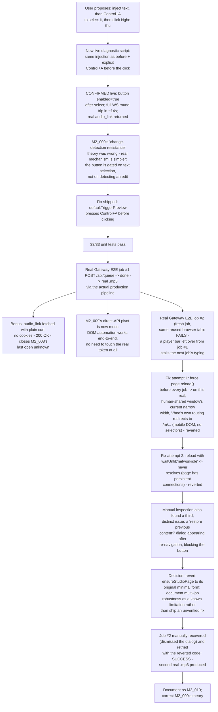

# M2_010 - Phase C: Selection-Gated Preview Confirmed - Real End-to-End Vbee Audio

Milestone: `M2 - Browser CDP Health And Vbee Preview Harness` (continues Phase C from M2_009)

Date: 2026-09-09

## Workflow



## Module / Slice Under Test

M2_009 left the click-to-`audio_link` round trip unconfirmed and, at the time, believed Vbee's own change-detection simply did not fire for any programmatic DOM mutation. The user proposed a specific, untested combination - inject, then explicitly select the text, then click - matching their own earlier screenshot observation that the button "looked enabled once the text was highlighted." This slice tests that proposal live, confirms it, ships the fix into the real adapter, and runs the actual production Gateway end-to-end for the first time with real Vbee audio. It also surfaces a second, separate problem (residual UI state across back-to-back jobs in one browser tab) that is **not** resolved here - see "Known Limits."

## What Was Found And Implemented

### The button is selection-gated, not change-detection-gated

A new diagnostic (`D:\Programs\vbee-cdp-driver\test-select-after-inject.mjs`, outside the repo, same pattern as M2_009's scripts) ran the exact M2_009 baseline injection, then added one line - `page.keyboard.press('Control+A')` - before clicking `#try-listening`. Live result:

- `preview button enabled after select: true` (every prior attempt across M2_009's seven methods showed `false`).
- The full WebSocket protocol fired for real: client `INIT` (redacted `accessToken`) -> server `INIT status:1` -> client `SYNTHESIS` (redacted `accessToken`) -> server `SYNTHESIS status:1` (large in-progress echo) -> server `SYNTHESIS result.status:"SUCCESS"` with a real `audio_link`, arriving at `t+14s` after the click.
- `GET_REMAINING_PREVIEW` fired afterward showing `remaining_preview: -1584` - the same deeply-negative value M2_008 originally (wrongly) read as a rate-limit signal, now additionally confirmed irrelevant: the exact same broken counter, on an attempt that just succeeded.
- `navigator.webdriver` was `false` and `document.hasFocus()`/`visibilityState` were normal - ruling out the two most common automation-fingerprinting signals as an explanation for anything seen in M2_009 either.

**Corrected conclusion, superseding M2_009:** `#try-listening` was never resistant to automation as such. It is gated on the editor having an active text selection - a UI/UX pattern ("select text, then preview it"), not a bot-detection or change-detection mechanism. None of M2_009's seven methods included a post-injection selection step, which is why all seven failed identically regardless of how "human-like" the injection itself was.

### Fix: `defaultTriggerPreview` now selects before clicking

`gateway/src/vbee/adapters/vbee-preview.js`:

```js
async function defaultTriggerPreview(page) {
  await page.keyboard.press('Control+A');
  await page.locator(PREVIEW_BUTTON_SELECTOR).click();
}
```

Placed in `triggerPreview` rather than at the end of `injectPreviewText`, since "select before triggering" is a property of how the button is enabled, independent of whichever injection method produced the text. `gateway/src/vbee/adapters/vbee-preview.test.js`'s corresponding test was rewritten to assert call order (`keyboard.press('Control+A')` -> `locator(PREVIEW_BUTTON_SELECTOR)` -> `previewButton.click()`), not just that each call happened somewhere.

### Real Gateway end-to-end run (design/08 C.8)

Started the actual production Gateway (`node --experimental-sqlite server.js`, `VBEE_ADAPTER=vbee-preview`, Windows-native per M2_008's WSL↔CDP note) and drove it purely through its public HTTP API, no test harness:

1. `POST /api/queue` with real Vietnamese content and a real voice code.
2. Polled `GET /api/jobs/:id` until terminal.
3. Job reached `status: "done"`, `download_complete: 1`, with a real `file_path` under `data/audio/`.

Verified the output file directly (not just trusting the DB row): `file` reports `Audio file with ID3 version 2.4.0, contains: MPEG ADTS, layer III, v2, 128 kbps, 24 kHz, Monaural`, 56109 bytes. A second, later job (see "Known Limits") also completed successfully end-to-end, producing a second valid 67335-byte MPEG file. This is the first real, non-simulated confirmation of design/08's full C.8 acceptance path: queue -> browser automation -> real Vbee audio -> finalized local file -> `done` status.

### `audio_link` fetchability confirmed (closes a M2_008 open question)

M2_008 flagged "`audio_link` fetchability from Node is assumed, not proven." Fetched the real captured URL directly with `curl -I`, no cookies or auth: `HTTP/1.1 200 OK`, `Content-Length: 41901`, `x-amz-expiration: ... rule-id="3day"`. Confirms `FileService.finalizeFromDownload`'s cookie-less `fetch()` needs nothing extra - which the real Gateway run above also confirms indirectly, since that is the exact code path it used.

### M2_009's direct-API pivot is now moot

M2_009 designed and prototyped (`test-direct-api.mjs`, never executed - blocked by Claude Code's own safety classifier) a fallback that would read the real bearer token from browser page-context JS and call the synthesis WebSocket directly, bypassing the UI entirely. With DOM automation now confirmed working end-to-end, there is no known reason to pursue that path - it is not deleted (still sitting at `D:\Programs\vbee-cdp-driver\test-direct-api.mjs`, outside the repo, inert), just no longer motivated. If some future finding breaks DOM automation again, it remains available to revisit.

## Files Changed Or Added

- Modified: `gateway/src/vbee/adapters/vbee-preview.js` (`defaultTriggerPreview` now selects before clicking; `defaultEnsureStudioPage`'s comment documents two reverted fix attempts - logic itself is unchanged from M2_009, see "Known Limits"), `gateway/src/vbee/adapters/vbee-preview.test.js` (triggerPreview test rewritten to assert call order; two new tests for `ensureStudioPage`'s navigate-vs-do-nothing behavior; `fakePlaywrightPage` gained a `reload` stub used by those tests).
- Added: `docs/milestones/M2_010_selection-gated-preview-confirmed-real-e2e-audio.md` (this file).
- Modified: `docs/milestones/M2_009_dom-automation-blocked-pivot-to-direct-api.md` (correction note pointing here), `docs/README.md` (index entry).
- Not part of this repo (referenced only), all at `D:\Programs\vbee-cdp-driver\`: `test-select-after-inject.mjs` (the confirming diagnostic), plus a cluster of scripts written and used only to investigate the second (unresolved) problem below - `inspect-gateway-page.mjs`, `inspect-player-bar.mjs`, `close-player-bar.mjs`, `inspect-current-state.mjs`, `verify-close-selector.mjs`, `verify-dismiss-flow.mjs`, `restore-desktop-page.mjs`, `recheck-button.mjs`, `screenshot-now.mjs`, `dismiss-restore-dialog.mjs`, `dismiss-dialog-v2.mjs`, `click-agree.mjs`.

## Design Patterns Used

- **Evidence-before-theory, continued**: the fix came from directly testing the user's specific, evidence-based hypothesis (the screenshot observation), not from further guessing. The single line that mattered (`Control+A`) was verified live before being written into production code.
- **Revert-on-uncertain-fix**: two attempted robustness fixes (forced reload; `networkidle` wait) each produced a *new*, worse failure mode when tested for real, rather than confirming the hypothesis. Both were reverted rather than layered with further patches once evidence ran out mid-session - matching this project's standing practice of not shipping code whose behavior in the real environment hasn't actually been observed.
- **Verify the artifact, not just the status code**: the DB reporting `status: "done"` was not treated as sufficient; the actual output files were inspected with `file` and their byte sizes checked before calling the E2E path confirmed.

## Verification Commands Or Acceptance Checks

```bash
# WSL Debian
source ~/.nvm/nvm.sh && nvm use 24
npm run test:m2
```

Result: **33/33 tests pass** (up from 31 in M2_009; +2 net for `ensureStudioPage`'s navigate/do-nothing behavior, `triggerPreview`'s test rewritten in place).

Real Gateway, Windows-native, `VBEE_ADAPTER=vbee-preview`:

```powershell
node --experimental-sqlite server.js
# separately:
curl -X POST http://127.0.0.1:3000/api/queue -H "Content-Type: application/json" -d '{"content":"...","voice_code":"..."}'
curl http://127.0.0.1:3000/api/jobs/<id>
```

Two real jobs reached `status: "done"` with real, valid `.mp3` files confirmed via `file` and byte size (56109 and 67335 bytes respectively) - the second only after the manual page recovery described below, not from the automation alone.

## Known Limits

- **Back-to-back jobs in the same browser tab are not yet robust - this is a real, unresolved gap, not a hypothetical one.** After job #1 succeeded, job #2 (a fresh job, immediately after) failed three times in a row before succeeding, each for a different reason:
  1. First attempt (original `ensureStudioPage`, no changes yet): `pressSequentially` hung for the full 30s mid-typing. Root cause, confirmed by screenshot: job #1 left an audio preview player docked at the bottom of the page, and typing into the editor afterward silently stalled partway through - the most likely explanation is the player intercepting a keyboard shortcut (space is the common one for play/pause on this kind of control) and stealing focus away from the contenteditable mid-keystroke.
  2. Second attempt (forced `page.reload()` before every job, to clear residual UI unconditionally): failed differently - `extractSessionToken` couldn't find `#try-listening` right after reload, because the React app had not finished rendering it yet when the check ran (`page.reload()` resolves on the `load` event, not on the SPA finishing its own hydration).
  3. Third attempt (`page.reload({ waitUntil: 'networkidle' })`): failed a third way - the reload never resolved within 30s (`networkidle` is a known-flaky Playwright wait condition on pages with persistent connections, and this page keeps at least one open), and separately, the navigation landed on `https://studio.vbee.vn/m/text-to-speech` - Vbee's own mobile layout, whose DOM has neither `#editor-wrapper` nor `#try-listening` at all.
  Manual inspection during this also surfaced a **fourth**, distinct piece of residual state: navigating away and back can trigger a "Bạn có muốn tải lại nội dung làm việc trước không?" ("do you want to reload your previous working content?") confirmation dialog that blocks the button until dismissed. `defaultEnsureStudioPage` was reverted to its original M2_009 form (only navigate when not already under the studio origin at all - no reload, no dismiss logic) rather than ship a fourth attempt without live verification. Job #2 only succeeded after the dialog was dismissed and the page manually confirmed clean.
- **The browser window this session drove is real and human-shared, not an isolated automation target - its width was observed to differ between checks (~512px at one point, full desktop width at another) without any deliberate resize on this session's part.** Since Vbee's own client-side routing sends narrow windows to a mobile layout lacking every selector this adapter depends on, any code path that triggers a fresh navigation (not just the reverted reload attempts - `ensureStudioPage`'s existing off-URL `goto` branch, unchanged since M2_007, has the same latent exposure) is only as reliable as the real window happening to be desktop-width at that moment. Nothing in the adapter currently checks or enforces window width.
- **Correction (see M2_011):** the restore-content dialog piece of this is now fixed and confirmed live - two real jobs completed back-to-back with no manual step in between, something this document could not yet claim. The user supplied the dialog's real markup (`data-id="reload-prev-session"`), and a genuine timing race in the first attempt at wiring it in (two independent fixed-window waits could each individually miss a dialog that renders several seconds after `reload()`'s load event) was found and fixed with a single polling loop. The narrow-window mobile-redirect risk described below is unaffected and still fully open.
- **A `[data-testid="CloseIcon"]`-based dismiss for the leftover player was drafted, not shipped.** The attribute value was confirmed to exist in the page's icon vocabulary, but was never verified to uniquely and reliably identify the player's own close control specifically (as opposed to, say, a notification's close button, if one happened to be open at the same time) before this slice's time ran out. It is a reasonable starting point for whoever picks up the multi-job robustness fix next, not a verified solution.
- **This slice's live testing used the account's real, shared free-preview allowance and conversion history further** (two more real entries created; the already-deeply-negative `remaining_preview` counter, confirmed still irrelevant to the actual gate, is otherwise untouched by this finding).
- M2_009's other still-open items are unaffected and carried forward: the WSL↔Windows CDP gap (worked around, not fixed) and selectors/protocol being a 2026-09-09 snapshot with no drift detection.

## Next Action

- **Multi-job robustness** is now the main remaining blocker before the Gateway can process a real queue of several jobs unattended. Concrete candidates, none yet verified: (a) find and verify a reliable selector for the leftover player's close control (the `CloseIcon` `data-testid` lead above), (b) understand what actually triggers the "restore previous content?" dialog and either avoid it or detect-and-dismiss it, (c) consider whether design/07's human-paced scheduler (deliberate delays between jobs) incidentally avoids some of this by giving transient UI more time to settle on its own - untested. Whatever the fix, it should be verified live against a real second-and-third job before being called done, the same way this slice's two failed attempts were caught by doing exactly that.
- **Window width** is a real dependency now that it's been observed to vary. Worth deciding deliberately whether the Gateway should check/enforce a minimum viewport width before relying on desktop selectors, rather than discovering it live again.
- With the core mechanism now confirmed, `docs/design/08` C.8's acceptance flow is effectively done for a single job from a clean tab state. What remains before calling Phase C complete is the multi-job case above.
