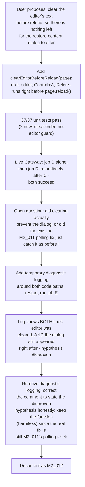

# M2_012 - Phase C: Pre-Reload Editor Clear - Hypothesis Tested And Disproven

Milestone: `M2 - Browser CDP Health And Vbee Preview Harness` (continues Phase C from M2_011)

Date: 2026-09-09

## Workflow



## Module / Slice Under Test

After M2_011 shipped the restore-dialog polling fix, the user proposed a preventive alternative: since the dialog only exists to offer restoring *something*, clearing the editor's text immediately before the reload that can trigger it should mean there is nothing left to prompt about, avoiding the whole race condition rather than reacting to it. This slice implements that proposal, verifies it does not regress anything, and then - critically - tests whether it actually does what it was proposed to do, rather than assuming success from job-level `status: "done"` alone (which would have looked identical either way, since M2_011's polling fix independently guarantees success regardless of whether the dialog appears).

## What Was Implemented

### `clearEditorBeforeReload(page)`, called before `page.reload()`

`gateway/src/vbee/adapters/vbee-preview.js`'s `defaultEnsureStudioPage` now clears the editor on the pre-reload page before reloading (only in the reload branch - a fresh `goto()` has no prior page to clear):

```js
async function clearEditorBeforeReload(page) {
  const editor = page.locator(EDITOR_SELECTOR);
  if (!(await editor.count())) return;
  await editor.click();
  await page.keyboard.press('Control+A');
  await page.keyboard.press('Delete');
}
```

Guards for the editor not being present (e.g. an unusual page state) by checking `count()` first rather than assuming it exists.

### Verified against unit tests first (37/37, up from 35)

Two new tests in `vbee-preview.test.js`: one locks the exact call order (`editor.click` -> `Control+A` -> `Delete` -> `reload`, using a fake page's call log), one confirms `reload()` still proceeds normally when no editor is present to clear. An existing test (`ensureStudioPage navigates when not yet on the studio page`) gained an added assertion that no clearing happens on that branch.

### Live verification, in two rounds

**Round 1 (job C, then job D immediately after):** both real Gateway jobs completed (`status: "done"`), each producing a distinct, valid `.mp3` (confirmed via file size + `49 44 33 04` / "ID3" + v4 header bytes: 34989 and 43437 bytes respectively). This confirmed the change did not regress the back-to-back reliability M2_011 had just established.

**Round 2 (job E, with temporary diagnostic logging):** job-level success alone could not distinguish "the dialog stopped appearing" from "the dialog still appeared and M2_011's polling fix caught it, same as always" - both would report `status: "done"`. To actually test the proposal's mechanism, `console.log` lines were temporarily added at both the clear step and the dialog-detected branch, the Gateway was restarted, and one more job was run. The real output:

```text
[diag] cleared editor before reload
[diag] restore dialog appeared despite pre-reload clear - clicking agree
```

**The hypothesis is disproven by direct evidence.** The editor was genuinely cleared (the click and both keypresses executed without error), and the restore dialog still appeared immediately afterward on the very next reload.

## Why This Result Makes Sense

The most likely explanation: Vbee's own autosave/draft-persistence almost certainly runs on a debounce *during* the previous job's `injectPreviewText` step (real keystrokes, typed well before this job's `ensureStudioPage` even starts) - not at the moment of reload. By the time `clearEditorBeforeReload` runs on the *next* job, whatever triggers the "restore previous content?" dialog has likely already been captured and persisted (server-side or in browser storage) well in the past. Clearing the DOM immediately before reload is simply too late to affect a decision Vbee's client already made earlier. This is analogous to M2_009's disproven change-detection theory and M2_010's disproven mobile-redirect-avoidance attempts: a reasonable, evidence-motivated hypothesis that live instrumentation directly contradicted.

## Files Changed Or Added

- Modified: `gateway/src/vbee/adapters/vbee-preview.js` (`clearEditorBeforeReload` added and wired into `defaultEnsureStudioPage`'s reload branch; comment documents the disproven hypothesis rather than a false prevention claim; temporary diagnostic `console.log` lines added, used to collect evidence, then removed).
- Modified: `gateway/src/vbee/adapters/vbee-preview.test.js` (`fakePlaywrightPage` gained `hasEditor` and a `count()` on the editor locator; two new tests; one existing test gained an added assertion).
- Added: `docs/milestones/M2_012_pre-reload-editor-clear-hypothesis-tested-and-disproven.md` (this file).
- Modified: `docs/README.md` (index entry).

## Design Patterns Used

- **Test the mechanism, not just the outcome.** Job-level success (`status: "done"`) was identical whether or not the pre-clear achieved anything, because M2_011's polling fix independently guarantees the outcome. Only instrumenting the actual code path distinguished "this works as theorized" from "this is inert and something else is doing the work" - the same discipline as M2_011's own "isolate before re-theorizing" step.
- **Evidence overrides a reasonable-sounding theory.** The proposal was sound reasoning from the outside (no leftover content, nothing to prompt about) - and still wrong, because it didn't account for *when* Vbee's own persistence actually runs. Live logging settled it in one round rather than layering further speculation.
- **Keep what's harmless, correct what's false.** Rather than ripping the function out, it stays (clearing the editor before a reload is never wrong to do) - but the comment above it was rewritten to state plainly that it does not achieve its original purpose, so a future reader does not inherit the same disproven assumption from a comment that used to assert it as fact.

## Verification Commands Or Acceptance Checks

```bash
# WSL Debian
source ~/.nvm/nvm.sh && nvm use 24
npm run test:m2
```

Result: **37/37 tests pass.**

Real Gateway, Windows-native, `VBEE_ADAPTER=vbee-preview`:

- Job C: `status: "done"`, 34989-byte `.mp3`, valid ID3v2.4 header.
- Job D: submitted immediately after job C finished, no restart, no manual step: `status: "done"`, 43437-byte `.mp3`, valid ID3v2.4 header.
- Job E (diagnostic build): `status: "done"`; Gateway stdout confirms both `clearEditorBeforeReload` ran successfully and the restore dialog still appeared and was dismissed by the existing M2_011 polling logic immediately after.

## Known Limits

- **The pre-reload clear does not prevent the restore dialog.** This is the headline finding of this slice, not a caveat to gloss over: `clearEditorBeforeReload` is confirmed live to not achieve the effect it was written for. It is kept only because it is harmless, not because it contributes to reliability - **M2_011's dialog-polling fix remains the sole real reliability mechanism** for this problem.
- **The debounce-timing explanation is inference, not confirmed.** It is the most likely explanation given what's been observed, but this session did not directly verify it (e.g. by adding a wait between clearing and reloading to see if a longer gap changes the outcome). Anyone picking this up should treat it as an untested next hypothesis, not settled fact.
- All of M2_010's and M2_011's other still-open items are unaffected and carried forward unchanged: the narrow-window mobile-redirect risk remains fully open, only a handful of back-to-back jobs (now five real jobs total across M2_010-M2_012, not an arbitrarily long queue) have been confirmed, and the 15-second poll budget is still a live-tuned number.

## Next Action

If the debounce theory is worth chasing further, the next concrete test is adding a short wait (a few seconds) between `clearEditorBeforeReload`'s Delete and the `reload()` call, to see whether giving Vbee's own autosave time to observe the emptied editor changes whether the dialog appears - this was explicitly not implemented here to avoid shipping a second unverified guess in the same slice. Otherwise, the same M2_011 next actions still stand: a longer unattended multi-job run, and a deliberate decision on the narrow-window mobile-redirect risk.
