# M2_013 - Phase D: Two-Machine Split — Token Auth, CORS, UI Settings, Tauri Remote Mode

Milestone: `M2 - Browser CDP Health And Vbee Preview Harness` (continues into `design/08`'s Phase D — see Process Note below)

Date: 2026-09-09

## Process Note

`.context/MILESTONES.md`/`AGENTS.md` still track `M2`'s original scope (which explicitly lists "Full official Vbee download flow" as *out of scope*) and don't mention `docs/design/08`'s Phase C/D/E/F roadmap at all. That drift predates this slice — Phase C already shipped six milestone docs (`M2_007`-`M2_012`) under the same numbering despite exceeding `M2`'s stated scope. This doc continues that established precedent rather than pausing to reconcile `.context/` tracking first; worth a conscious, named decision (matching `AGENTS.md`'s own protocol to flag scope conflicts) rather than a silent one.

## Workflow

```mermaid
flowchart TD
  Plan["design/08 Phase D approved:\nsplit Gateway (backend) and\nTauri shell (UI) across 2 machines\nover Tailscale"] --> Read["Read actual current code:\nconfig.js, routes.js, app.js,\nlib.rs, gateway_lifecycle.rs,\ntauri.conf.json"]
  Read --> Gap["Found a real gap the design doc\ndidn't mention: the Tauri window's\nURL is hardcoded in tauri.conf.json -\nremote mode needs it built in Rust"]
  Gap --> D1D2["D.1+D.2: GATEWAY_AUTH_TOKEN +\nCORS_ORIGIN in config.js/routes.js,\nnew config.security (kept out of\nconfig.runtime so /health can't leak it)"]
  D1D2 --> Tests1["46/46 JS tests pass\n(9 new in routes.test.js)"]
  Tests1 --> LiveCheck["Live curl-equivalent checks against\nthe real Gateway: no/wrong/correct\ntoken, /health exemption, OPTIONS\npreflight - all 5 match design"]
  LiveCheck --> D3["D.3: Connection settings panel\n(public/index.html), apiFetch()\nBearer header + audioSrc() ?token=\nfallback (public/app.js)"]
  D3 --> BrowserCheck["Verified live in the Browser pane:\nsave form -> localStorage -> Bearer\nheader on real fetch calls -> token\non the <audio src>"]
  BrowserCheck --> D4["D.4: dynamic window URL +\nRuntimeOwner remote branch +\nstatus_remote() in Rust\n(tauri.conf.json, lib.rs,\ngateway_lifecycle.rs, +ureq)"]
  D4 --> RustCheck["cargo check clean, 6/6 Rust\nunit tests pass (WSL Linux target -\nno Windows-native Rust toolchain\nin this environment, see Known Limits)"]
  RustCheck --> Doc["Document as M2_013"]
```



## Module / Slice Under Test

Phase C (M2_007-M2_012) proved the one genuinely risky part of this project — real Vbee automation — works reliably on one machine. Per `design/08`'s approved, mandatory phase order ("C → D → E"), this slice implements Phase D: split the system across two machines over Tailscale, with a Gateway/Brave/Vbee "backend machine" and a Tauri-shell "UI machine". Today's Gateway has zero auth and zero CORS, and the Tauri shell only knows how to auto-start and talk to a same-machine Gateway — none of that is safe or functional across a network. This slice implements D.1 (token auth), D.2 (CORS), D.3 (UI settings for base URL + token), and D.4 (Tauri remote mode), all verifiable on a single machine; D.5 (user-performed Tailscale setup) and the cross-machine parts of D.6's acceptance checklist are out of scope here and remain a follow-up once a second machine is available.

## What Was Implemented

### D.1 — Token auth (`gateway/src/config.js`, `gateway/src/api/routes.js`)

`config.js` gained a `security` key **as a sibling of `runtime`, not nested inside it** — `/health` echoes `runtime` wholesale, so an `authToken` living inside `runtime` would leak through the one endpoint that must stay unauthenticated for monitoring:

```js
security: {
  authToken: process.env.GATEWAY_AUTH_TOKEN || '',
  corsOrigin: process.env.CORS_ORIGIN || ''
}
```

`routes.js` gates every route except `GET /health`, `GET /`, and `GET /dev/*` (the static UI shell, which needs to load before it has a token to send) behind `Authorization: Bearer <token>`, checked before any existing route branch runs. When `GATEWAY_AUTH_TOKEN` is unset, `authToken` is `''` (falsy) and the whole block is skipped — zero behavior change for the one-machine default.

### D.2 — CORS (`routes.js`, same file)

When `CORS_ORIGIN` is set, `Access-Control-Allow-Origin/-Headers/-Methods` are set via `res.setHeader()` **before** the auth check runs, and `OPTIONS` short-circuits to `204`. Two things worth being explicit about, since they're easy to get subtly wrong: a browser preflight never carries `Authorization`, so gating `OPTIONS` behind auth would silently break the real follow-up request; and a failed-auth response still needs the CORS header on it, or the browser reports an opaque CORS failure instead of a readable 401. This needed zero changes to `http-utils.js` — Node's `res.writeHead(status, headers)` merges with headers already set via `setHeader()` rather than replacing them, and every response path there only ever calls `writeHead`.

### D.3 — UI connection settings (`public/index.html`, `public/app.js`)

A new "Connection" panel (reusing existing `.panel`/`.composer`/`.field-full` classes verbatim — zero new CSS) lets the UI point at a different `gatewayBaseUrl` and carry a `gatewayToken`, persisted to `localStorage` (`vf.gatewayBaseUrl`/`vf.gatewayToken`, mirroring the existing `zc-theme` pattern). `api()` was renamed `apiFetch()` and now prepends `gatewayBaseUrl` and attaches `Authorization: Bearer <token>` when a token is set; a new `audioSrc()` helper appends `?token=` to `<audio src>` instead, since a bare `<audio>` tag's native media loader cannot send a custom header — the one deliberately weaker link in the auth story, scoped to exactly that one read-only route rather than exempting it outright.

### D.4 — Tauri remote mode (`src-tauri/tauri.conf.json`, `lib.rs`, `gateway_lifecycle.rs`, `Cargo.toml`)

A real structural gap not mentioned in `design/08`: the Tauri window's URL was hardcoded in `tauri.conf.json` (`app.windows[0].url = "http://127.0.0.1:3000"`), so "skip auto-start, poll remote health" alone would leave the window trying to load a local address with nothing listening. Fixed by emptying `tauri.conf.json`'s `windows` array and constructing the window in Rust instead, inside `setup()`, choosing between `http://127.0.0.1:3000` and `$VOICEFACTORY_REMOTE_GATEWAY_URL` before the first navigation (`WebviewWindowBuilder`/`WebviewUrl::External` — Tauri v2's documented pattern for this).

`RuntimeOwner` gained a `remote_url: Mutex<Option<String>>` slot; all 6 `#[tauri::command]` functions (`gateway_runtime_*`, `browser_runtime_*`) now check it first and, if set, return `gateway_lifecycle::status_remote(&url)` instead of touching the local-process-management path (`scripts/*-lifecycle.mjs`, whose whole job is pid + state-file bookkeeping for a *local* child process — deliberately left untouched, since none of that applies to a remote machine). `status_remote` (new, in `gateway_lifecycle.rs`) does a plain `ureq::get` against `<url>/health` with a 1.5s timeout and never returns `Err` — an unreachable backend becomes `degraded: true`, mirroring `gateway-lifecycle.mjs status`'s existing "report `ok:false` cleanly, don't fail" contract. `owned_by_shell: false` always, in every remote snapshot — this is what backs D.6's "remote mode does not spawn local gateway/browser."

`ureq = "2"` was added to `Cargo.toml` — chosen over `reqwest` because nothing in this codebase uses an async runtime (every Tauri command here is a plain synchronous `fn`); `ureq` is sync and needs no `tokio`. It pulled in `rustls` (not a system OpenSSL/native-tls dependency), a reasonably light addition.

## Files Changed Or Added

- `gateway/src/config.js` (new `security` key).
- `gateway/src/api/routes.js` (CORS + auth gating, `bearerTokenFrom`/`isAuthExempt` helpers).
- Added: `gateway/src/api/routes.test.js` (first test file for this module — 9 cases).
- `public/index.html` (new Connection panel), `public/app.js` (`apiFetch`, `audioSrc`, `saveConnectionSettings`, `state`/`el` extensions).
- `src-tauri/tauri.conf.json` (`windows: []`), `src-tauri/src/lib.rs` (`RuntimeOwner.remote_url`, dynamic window construction, remote branch on all 6 commands), `src-tauri/src/gateway_lifecycle.rs` (`status_remote`, `remote_snapshot_from_health_json`, 3 new tests), `src-tauri/Cargo.toml` (`+ ureq`).
- Added: this file. Modified: `docs/README.md` (index entry).

## Design Patterns Used

- **Keep the secret out of the object that gets echoed wholesale.** `config.security` is a sibling of `config.runtime`, not nested in it, specifically because `/health` returns `runtime` verbatim — the guardrail is structural, not a comment asking future code to remember not to leak it.
- **CORS before auth, unconditionally.** Ordering here isn't arbitrary — a preflight without CORS headers set first would make the browser reject the *real* request before auth ever gets a chance to matter, and an unauthenticated response still needs to be CORS-readable to show the user anything better than an opaque network error.
- **Read the real current code before trusting the design doc's file list.** `design/08`'s D.3 only names `app.js`; the actual convention in this codebase (every other static form lives in `index.html`, `app.js` only wires listeners/injects dynamic content) meant the settings form belonged in `index.html` instead. The Tauri window's hardcoded URL wasn't mentioned in the design doc at all — it only surfaced from reading `tauri.conf.json` directly, and would have silently broken remote mode if missed.
- **Verify against the real running process, not only fakes.** `routes.test.js`'s 9 cases exercise the auth/CORS logic against hand-built fakes; a separate live pass (below) hit the *actual* Gateway process with real `Invoke-WebRequest` calls for all 5 D.6-relevant scenarios, closing the gap between "the fake test passes" and "the real server does this."

## Verification Commands Or Acceptance Checks

```bash
# WSL Debian
source ~/.nvm/nvm.sh && nvm use 24
npm run test:m2
```

Result: **46/46 tests pass** (37 prior + 9 new in `routes.test.js`).

```bash
# WSL Debian, src-tauri/
~/.cargo/bin/cargo check
~/.cargo/bin/cargo test
```

Result: `cargo check` clean (0 errors); **6/6 Rust unit tests pass** (3 prior `snapshot_from_json` tests + 3 new `remote_snapshot_from_health_json` tests).

Live, against the real Windows-native Gateway process (`GATEWAY_AUTH_TOKEN=live-verify-secret CORS_ORIGIN=http://localhost:1420`):

| Check | Result |
|---|---|
| `GET /api/queue`, no `Authorization` | `401` |
| `GET /api/queue`, wrong token | `401` |
| `GET /api/queue`, correct token | `200` |
| `GET /health`, no token | `200` (exemption holds) |
| `OPTIONS /api/queue` | `204`, `Access-Control-Allow-Origin: http://localhost:1420` |

Gateway was then restarted with `GATEWAY_AUTH_TOKEN`/`CORS_ORIGIN` unset again, confirming the default one-machine experience is unaffected.

D.3 was verified live in the Browser pane against the real running Gateway: filled the Connection form's token field, confirmed (after working around a browser-automation click-coordinate miss by dispatching the submit directly, then re-confirming the real click path via a fresh element read) that `localStorage` persists `vf.gatewayBaseUrl`/`vf.gatewayToken`, that a monkey-patched `window.fetch` shows `apiFetch()` actually sends `Authorization: Bearer <token>` on a real `/api/queue` call, and that the Assets tab's `<audio src>` carries `?token=<token>` for a real existing asset.

## Known Limits

- **The actual Tauri GUI was never launched in this pass.** This environment has no Windows-native Rust/Cargo toolchain (only inside WSL, targeting Linux) — `npm run desktop:dev`/`cargo build` on Windows, which is what would actually open the window and prove the dynamic-URL construction and remote-mode branch work end-to-end, could not be run. Verification stopped at `cargo check` + `cargo test` (WSL, Linux target) — real evidence that the Rust logic is type-correct and the pure functions behave as intended, but not proof the app actually builds/links/runs as a Windows GUI binary. Installing a Windows-native Rust toolchain wasn't done without asking first, per this project's own "don't install new system tools without approval" rule.
- **No real second machine or Tailscale network was involved.** Everything above is single-machine (or single-machine-with-a-fake-response) evidence. The actual cross-machine scenario — a UI machine's Tauri app, in real remote mode, over a real Tailscale link, creating a job and playing audio served by a backend machine — is D.6's core acceptance item and remains fully untested, per the plan's explicit call-out that this needs a real second machine.
- **`window.__TAURI__` may not inject into a remote-origin window** (Tauri v2 scopes IPC injection to configured origins). `app.js`'s `refreshDesktopRuntime()` already guards for a missing `invoke`, so this is a known, accepted, purely cosmetic gap in the "Desktop" status pill in remote mode — not investigated further, not blocking.
- The `?token=` query-string fallback for `/api/audio/*` is a deliberately-named weaker link (browser history, potential future access-log exposure) versus header-based auth everywhere else — documented as an accepted trade-off in the plan, not an oversight.
- `.context/MILESTONES.md`/`AGENTS.md` drift (see Process Note) is carried forward unresolved, consistent with Phase C's six prior milestone docs.

## Next Action

The concrete blocker to closing out D.5/D.6 fully is a second machine: install Tailscale on both, run the backend with `GATEWAY_AUTH_TOKEN`/`HOST=<tailscale-ip>` set, and drive the Tauri UI machine in remote mode against it, capturing real `curl`/screenshot evidence per D.6. Separately — and independent of having a second machine — verifying the actual Tauri GUI even launches correctly in local mode after the dynamic-window change is worth doing as soon as a Windows-native Rust toolchain is available (whether that means installing one here with explicit sign-off, or the user checking it on their own machine).
