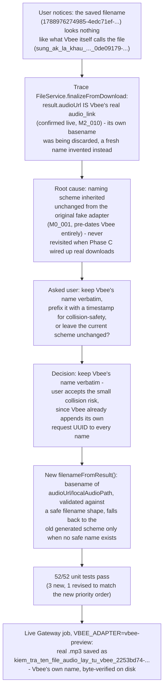

# M2_015 - Preserve Vbee's Own Filename When Finalizing A Downloaded Asset

Milestone: `M2 - Browser CDP Health And Vbee Preview Harness`

Date: 2026-09-10

## Workflow



## Module / Slice Under Test

The user asked, plainly, why a saved asset's filename (`1788976274985-4edc71ef-d421-4e48-a925-a6a4014ef62a.mp3`) didn't match what Vbee itself calls the same audio (`sung_ak_la_khau_sung_canh_tranh_voi_m_16_0de09179-29df-4d07-92a1-b7d8d3e7decc`, seen directly in Vbee's own UI/link). Tracing `FileService.finalizeFromDownload` (`gateway/src/infrastructure/files/file-service.js`) showed the real cause: `result.audioUrl` passed into that function *is* Vbee's real `audio_link` (an S3 URL, confirmed live back in M2_010 via a cookie-less `curl -I` returning `x-amz-expiration`), and its basename already carries Vbee's own meaningful name - a content slug plus Vbee's own per-request UUID. `finalizeFromDownload` fetched the bytes from that URL and then threw the name away, inventing its own `${Date.now()}-${safeName(job.id)}${ext}` instead. That scheme dates back to `createFakeAsset` in the original M0 fake-adapter design, where there was no provider name to preserve at all - Phase C's real-Vbee wiring (M2_007) reused the same `finalizeFromDownload` naming logic without reconsidering it for a provider that *does* hand back a meaningful name.

## Decision

Asked the user directly: keep Vbee's name verbatim, prefix it with a timestamp for extra collision-safety, or leave the current scheme as-is. Answer: keep Vbee's name verbatim - Vbee already appends its own request UUID to every generated name, so the residual collision risk is accepted as negligible, and a genuinely unmodified filename (not a hybrid) was the actual ask.

## What Changed

`gateway/src/infrastructure/files/file-service.js`: new `filenameFromResult(result)` helper, tried before falling back to the pre-existing generated-name scheme:

```js
function filenameFromResult(result) {
  const source = result?.audioUrl || result?.localAudioPath;
  if (!source) return null;

  let raw;
  try {
    raw = decodeURIComponent(path.basename(new URL(source).pathname));
  } catch {
    raw = path.basename(source);
  }

  return /^[\w-]+\.[a-zA-Z0-9]{1,6}$/.test(raw) ? raw : null;
}
```

`finalizeFromDownload` now does:

```js
const filename = filenameFromResult(result) || `${Date.now()}-${safeName(job.id)}${resolveAudioExtension(result)}`;
```

- Tries `audioUrl` first, then `localAudioPath` - covers both of `finalizeFromDownload`'s existing input shapes, not just the live Vbee path.
- `new URL(source)` handles a real URL (`audioUrl`); a plain filesystem path (`localAudioPath`) throws there and falls through to a direct `path.basename()` - both branches land on the same validation.
- The regex requires a real `name.ext` shape (letters/digits/underscore/hyphen, a dot, then a short alphanumeric extension) - deliberately excludes a bare extensionless route segment (e.g. `stream` from `.../stream?token=abc`, one of the existing test fixtures), which correctly falls back to the old scheme's own format-sniffing (`resolveAudioExtension`, unchanged) rather than producing a file with no extension at all.
- Also excludes anything that isn't a plain safe basename in the first place (path.basename already strips `/`/`\`; the regex additionally rejects a stray `..`), as defense in depth on top of `resolveAudioPath`'s existing traversal guard, since this name now comes from externally-controlled data.
- When a provider filename is used, it wins wholesale - including its extension - over `metadata.format`. In the one adapter that exercises this path today (`VbeePreviewAdapter`), `metadata.format` is hardcoded to `'mp3'` and Vbee's own links are always `.mp3`, so this is not an active behavior change for real jobs; it only reorders priority for the synthetic case where a test fixture deliberately mismatches URL extension and declared format.

## Files Changed Or Added

- `gateway/src/infrastructure/files/file-service.js`: added `filenameFromResult`; `finalizeFromDownload` now calls it before falling back to the old generated-name scheme. `createFakeAsset` untouched - no provider name exists on that path.
- `gateway/src/infrastructure/files/file-service.test.js`: revised `finalizeFromDownload prefers metadata.format over the URL extension` (renamed, now asserts the provider filename wins wholesale); added `finalizeFromDownload uses Vbee's real audio_link basename verbatim` (realistic slug+UUID fixture) and `finalizeFromDownload falls back to the generated name when the URL has no filename-shaped basename` (covers the no-extension case, and confirms `metadata.format` still applies in that fallback).
- `docs/README.md`: index entry for this milestone.

## Design Patterns Used

- **Investigate the real data before changing behavior.** Confirmed `result.audioUrl` really is Vbee's own `audio_link` (not a Gateway-internal construct) by re-reading M2_010's own live evidence, rather than assuming.
- **Ask when a decision has real trade-offs, don't guess.** Unlike the earlier UI-bug fixes this session (unambiguous, single correct fix), this one had a genuine choice - full trust in the provider's name vs. a safety-prefixed hybrid - so it went to the user instead of being silently decided.
- **Fallback preserves prior behavior exactly**, verified by keeping (and where needed, relocating) the existing extension-resolution tests rather than deleting them - the old scheme isn't gone, it's now the second-choice path.
- **Live evidence over unit tests alone**, consistent with this project's pattern for anything touching the real Vbee pipeline: restarted the actual Gateway (`VBEE_ADAPTER=vbee-preview`), submitted a real job, and confirmed the on-disk filename and byte content directly - not just that fixtures pass.

## Verification Commands Or Acceptance Checks

```bash
# WSL
source ~/.nvm/nvm.sh && nvm use 24
npm run test:m2   # 52/52 pass (48 before this slice + 3 new - 1 net, from the 1 revised test)
```

Live, Windows-native, real Gateway:

```
VBEE_ADAPTER=vbee-preview node --experimental-sqlite server.js
POST /api/queue  {"content":"Kiem tra ten file audio lay tu Vbee.", "voice_code":"hn_female_ngochuyen_full_48k-fhg", "speed":1.05, "incognito":true}
```

Result: `GET /api/assets` shows `filename: "kiem_tra_ten_file_audio_lay_tu_vbee_2253bd74-64b3-4079-88f2-f4c238da33b2.mp3"` - a real Vbee-generated name (content slug + Vbee's own request UUID), not the old `<timestamp>-<internal-job-id>` shape. Confirmed the file exists on disk at that exact path, 38061 bytes.

## Known Limits

- **Filename collisions are no longer structurally impossible, only unlikely.** `audio_assets.filename`/`tts_log.filename` have no `UNIQUE` constraint at the DB level, and `fs.rename(tmpPath, finalPath)` overwrites silently. If Vbee ever produced two different `audio_link`s sharing the same basename, the older file's bytes would be lost while its `audio_assets` row would still claim to point at it. Accepted per the user's explicit choice - Vbee's own per-request UUID makes this very unlikely in practice - but it is a real, if small, regression from the old scheme's guaranteed-unique names.
- **Extension is now trusted from the provider name without cross-checking `metadata.format`**, when a safe provider name is found. Not a live issue today (`VbeePreviewAdapter` never disagrees with itself), but a future adapter that reports a `metadata.format` genuinely different from its own URL's extension would end up with a file named by the URL, not the declared format - unlike before this change.
- Only `finalizeFromDownload` (the real-download path) is affected. `createFakeAsset` (fake adapter) keeps its original `<timestamp>-<job-id>.wav` naming untouched, since there is no provider-supplied name to prefer there.

## Next Action

None pending from this slice - implemented, tested, and live-verified in one pass. Worth keeping in mind if `M3`'s provider registry work (per `.context/MILESTONES.md`) ever adds a second real provider: `filenameFromResult` is provider-agnostic already (keys off `result.audioUrl`/`result.localAudioPath`, not anything Vbee-specific), so it should need no changes there.
