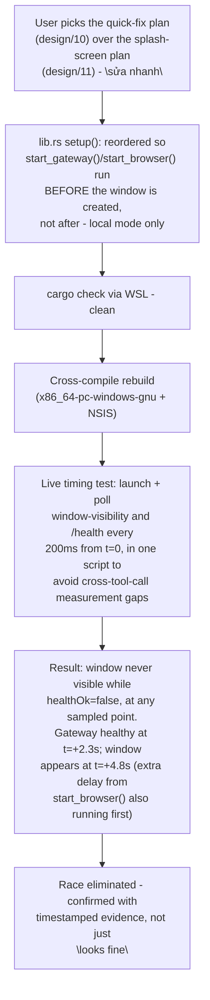

# M2_017 - Startup Race Quick Fix: Implemented And Live-Verified

Milestone: `M2 - Browser CDP Health And Vbee Preview Harness`

Date: 2026-09-10

## Workflow



## Module / Slice Under Test

Implements [design/10_startup-race-quick-fix-plan.md](../design/10_startup-race-quick-fix-plan.md) in full, as approved by the user's explicit choice ("sửa nhanh") over the alternative splash-screen plan (design/11). Closes Bug 3 from [M2_016](M2_016_windows-installer-packaging-two-startup-bugs-found-fixed.md): the Tauri window used to start navigating to the Gateway's URL before `start_gateway()` had even been called, let alone succeeded, so every cold start raced the webview's own "connection refused" page against the Gateway actually coming up.

## What Changed

`src-tauri/src/lib.rs`, `.setup()`: exactly the reorder proposed in design/10 - `start_gateway()`/`start_browser()` (local mode only; remote mode is unaffected, unchanged) now run and return *before* `WebviewWindowBuilder::new(...).build()` is ever called, and the window is built with whichever URL is now known to be correct (`DEFAULT_LOCAL_URL` after a successful local start, or the remote URL immediately in remote mode). No other files touched - matches design/10's own stated scope exactly (single file, no new structures).

## Verification

```bash
# WSL
~/.cargo/bin/cargo check --manifest-path src-tauri/Cargo.toml   # clean
npx tauri build --target x86_64-pc-windows-gnu                  # exit 0
```

Live timing test (Windows-native, PowerShell): killed all stale instances, cleared `.local/runtime` state, then launched the built exe and polled `Get-Process -Name voicefactory-desktop`'s `MainWindowTitle` (visible/not) alongside `GET /health` every 200ms, both in the same script starting from `t=0` to avoid the cross-tool-call timing gap that made a first attempt at this measurement inconclusive.

| t (ms) | Gateway healthy | Window visible |
|---|---|---|
| +274 | false | false |
| +2269 → +3251 | **true** | false |
| +4775 onward | true | **true** |

Zero samples show `windowVisible=true` while `healthOk=false` - the race is gone. The window now appears ~1.5-2.5s *after* the Gateway is already confirmed healthy (extra delay from `start_browser()` also running synchronously before the window is built), never before. Matches design/10's predicted trade-off exactly: no more error-page flash, at the cost of the window not appearing at all (no visual feedback) for a few seconds on cold start.

## Design Patterns Used

- **Measure the actual race, don't eyeball it.** A first timing-test attempt (launch in one tool call, poll loop in a second) had a ~23s gap before the first sample due to cross-call dispatch latency - useless for catching a multi-second transition. Redone as a single script (launch + immediate polling loop together) to get real `t=0`-relative timestamps.
- **Implement exactly what the approved plan said**, no scope creep - design/10 predicted this trade-off (window silent for a few seconds) explicitly rather than discovering it as a surprise; the live data confirms the prediction rather than contradicting it.

## Known Limits

- Same limits as M2_016 carry forward (NSIS installer itself not run end-to-end; no genuine second machine tested; Node.js/Brave remain unbundled prerequisites).
- The "no visual feedback while waiting" trade-off explicitly accepted in design/10 is now live and confirmed, not just theoretical - on a slower machine or a cold Brave-profile first run, this could be a several-second silent wait. If that turns out to bother real usage, design/11's splash-screen plan is the documented next step.
- Nothing from this slice is committed to git yet.

## Next Action

None required - design/10 is now fully implemented and verified. design/11 (splash screen) remains available as a future upgrade if the silent-wait window proves annoying in practice, but is not scheduled.
