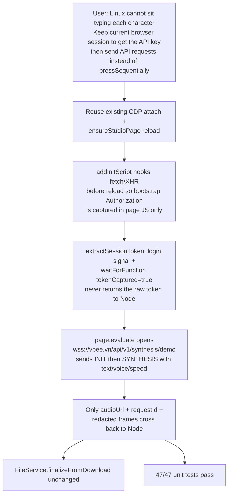

# M2_019 - Vbee Preview Via Session Token And Direct API (No Keystroke Typing)

Milestone: `M2 - Browser CDP Health And Vbee Preview Harness`

Date: 2026-09-14

## Workflow



## Module / Slice Under Test

The real `VbeePreviewAdapter` path still depended on Playwright typing the job text into Vbee Studio's Draft.js editor (`pressSequentially` at 20ms per character), then selecting and clicking `#try-listening`. That works on a shared headed Windows session (M2_010–M2_012) but is a poor fit for Linux: long texts take a long time, leftover player UI can steal keystrokes, and the operator cannot sit watching each character land.

The user asked to keep the current browser-session approach for obtaining the API key, then pump the already-known synthesis API instead of typing. This slice implements the M2_009 direct-API pivot that was designed, prototyped outside the repo, and then set aside when DOM automation started working.

## What Was Implemented

`gateway/src/vbee/adapters/vbee-preview.js` default flow is now:

```text
installTokenCapture  -> page.addInitScript (fetch + XHR Authorization hook)
ensureStudioPage     -> reload/goto so bootstrap traffic fires into that hook
extractSessionToken  -> login redirect check, #try-listening present, tokenCaptured boolean
requestPreviewSynthesis -> page.evaluate() WebSocket INIT/SYNTHESIS round trip
```

Removed from the production path:

```text
locateEditor
injectPreviewText (Control+A / Delete / pressSequentially)
triggerPreview (Control+A + #try-listening click)
capturePreviewAudioUrl (listen to the page's own WebSocket after a click)
```

Credential boundary (design/06):

- The bearer is stored on `window.__vbeeToken` inside the studio page.
- Node only sees a boolean capture flag and a redacted frame log.
- `page.evaluate` arguments are `{ content, voiceCode, speed, wsUrl, timeoutMs }` — no token.
- Return values go through `redactSensitiveFields` before the protocol recorder.

`voice_code` and `speed` are now sent on the SYNTHESIS payload instead of being ignored because the UI voice/speed pickers were never automated (M2_014). The exact extra fields Vbee's live SYNTHESIS payload may require are still a live-verification risk.

`ensureStudioPage` still reloads and still dismisses `data-id="reload-prev-session"` so a human-shared window is not left behind a modal. It no longer clears or types into the editor.

## Files Changed Or Added

- Modified: `gateway/src/vbee/adapters/vbee-preview.js`, `gateway/src/vbee/adapters/vbee-preview.test.js`, `gateway/src/vbee/protocol/preview-recorder.js` (comment only)
- Modified: `docs/design/06_voicefactory-provider-adapter-contract.md`, `docs/design/07_vbee-dual-execution-workflows.md`
- Added: this file, `docs/milestones/M2_019_vbee-preview-test-report.md`
- Modified: `docs/README.md`

## Design Patterns Used

- **Page-context credential confinement:** the token is read and used only in the same browser execution context that already holds the user's Vbee login. Gateway, JobRunner, UI, and logs never receive it.
- **Keep the session, drop the DOM driver:** CDP + headed login stays the auth method; the editor is no longer the synthesis transport.
- **Redact at the process boundary:** anything crossing `page.evaluate()` back to Node is run through `redactSensitiveFields` before the recorder.

## Verification Commands Or Acceptance Checks

```bash
source ~/.nvm/nvm.sh && nvm use 24
node --check gateway/src/vbee/adapters/vbee-preview.js
npm run test:m2
```

Result: **47/47 unit tests pass.** Syntax check clean.

Live Vbee round trip was **not** run this slice (no logged-in Linux CDP session was exercised here). Fake adapter remains the default (`VBEE_ADAPTER=fake`).

## Known Limits

- **Live API round trip is unit-tested, not live-confirmed.** M2_009's `test-direct-api.mjs` was never executed against a real account. This wiring follows that design and the M2_008 WS frame shape, but a real `VBEE_ADAPTER=vbee-preview` job on a logged-in studio session is still required to prove Vbee accepts `{ text, voice_code, speed }` as the SYNTHESIS payload.
- If Vbee's live SYNTHESIS payload requires additional fields (bitrate, sample rate, project id), the first live job will fail with `synthesis-failed` or timeout until those fields are added from a redacted live capture.
- Login is still manual in the headed browser. This change does not store JWT anywhere and does not remove the CDP/browser dependency.
- Official Vbee download flow is unchanged and still out of scope.

## Next Action

Linux Gateway remains the production worker. Until that machine has its own logged-in studio session, the Windows CLI in `scripts/vbee-windows-direct-api.bat` (M2_020) can prove token capture + SYNTHESIS against today's Windows Brave. If the payload is rejected, capture a redacted live frame and extend the adapter once.
