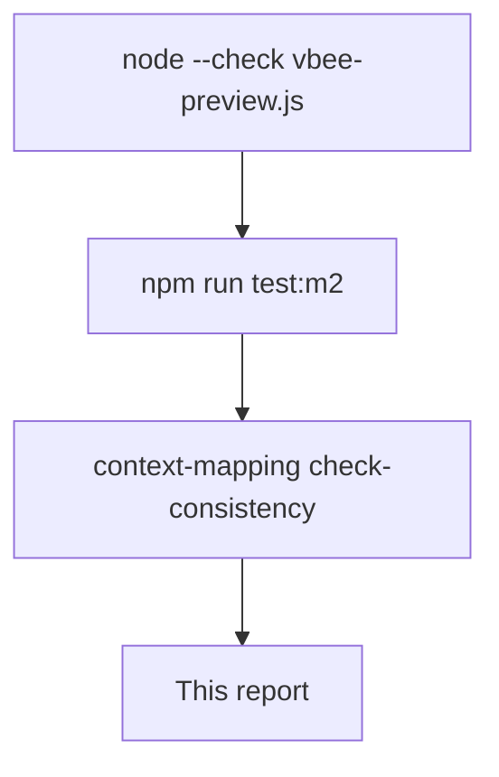

# M2_019 - Vbee Preview Direct API Test Report

Milestone: `M2 - Browser CDP Health And Vbee Preview Harness`

## Workflow



## Test Date

2026-09-14

## Module Under Test

```text
gateway/src/vbee/adapters/vbee-preview.js
gateway/src/vbee/protocol/preview-recorder.js
```

## Commands Run

```bash
source ~/.nvm/nvm.sh && nvm use 24
node --check gateway/src/vbee/adapters/vbee-preview.js
node --check gateway/src/vbee/adapters/vbee-preview.test.js
npm run test:m2
/home/shinkuro/.venvs/context-mapping/bin/python ../context-mapping/cli.py check-consistency .
```

## Result

PASS (unit + syntax + context). Live Vbee synthesis was not run.

`npm run test:m2`: **47/47 pass**, 0 fail.

`check-consistency`: **OK  Context files consistent.**

## Cases Covered

- Normalized adapter result shape is unchanged (`provider`, `audioUrl`, `executionMode: vbee_preview_download`).
- `addInitScript` is registered before `reload`/`goto`.
- Login redirect and missing `#try-listening` still fail closed.
- Missing page-context token capture fails closed without leaking a token value.
- `page.evaluate` args include `content`, `voice_code`, `speed`, and the demo WS URL — not `accessToken` / `Bearer`.
- Default flow does not call `pressSequentially`, editor clicks, or `#try-listening`.
- Failed page-context round trip maps to a job error; a planted `accessToken` in the evaluate result does not appear in the thrown message.
- `redactSensitiveFields` still redacts nested token-shaped keys.

## Residual Risk

- SYNTHESIS payload field set is inferred from job fields + M2_008/M2_009 protocol shape, not from a new live capture.
- Token hook depends on the studio app still sending `Authorization: Bearer` on bootstrap fetch/XHR after reload.
- No live Linux CDP job was executed in this slice.

## Next Action

Human-gated live job: headed browser logged into `studio.vbee.vn`, CDP up, `VBEE_ADAPTER=vbee-preview`, `POST /api/queue` with real content.
