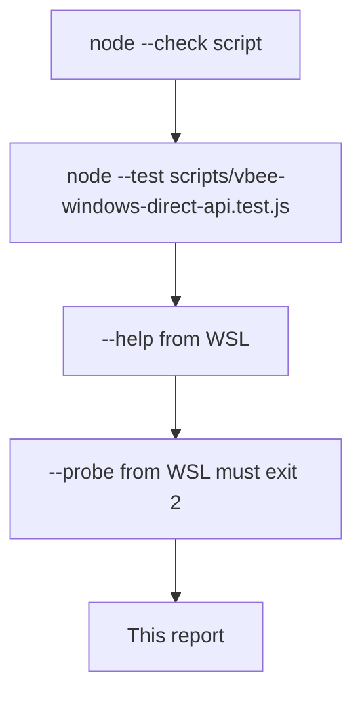

# M2_020 - Windows Direct API Driver Test Report

Milestone: `M2 - Browser CDP Health And Vbee Preview Harness`

## Workflow



## Test Date

2026-09-14

## Module Under Test

```text
scripts/vbee-windows-direct-api.mjs
scripts/vbee-windows-direct-api.bat
```

## Commands Run

```bash
source ~/.nvm/nvm.sh && nvm use 24
node --check scripts/vbee-windows-direct-api.mjs
node --test scripts/vbee-windows-direct-api.test.js
node scripts/vbee-windows-direct-api.mjs --help
node scripts/vbee-windows-direct-api.mjs --probe
```

## Result

PASS for CLI parsing, Windows-host guard, and redaction.

- Unit tests: **6/6 pass**
- `--help` from WSL prints usage (does not connect CDP)
- `--probe` from WSL: exit 2, probe is for today's Windows Brave CDP (Linux Gateway remains the production worker)

Live Windows Brave attach: **not run**.

## Cases Covered

- Default mode is `--probe`
- `--text` / `--voice` / `--speed` / `--cdp` parse
- Unknown flags and `--speed 0` reject
- Linux platform refused unless `--force`
- `sanitizeResult` drops `accessToken`, keeps `audioUrl`
- Help does not tell the user to paste a JWT

## Residual Risk

- `connectOverCDP` from Windows Node against this repo's WSL-installed Playwright is unverified.
- Real SYNTHESIS payload may need more fields than `{ text, voice_code, speed }`.

## Next Action

Run `scripts\vbee-windows-direct-api.bat --probe` from cmd.exe with Brave CDP already up.
