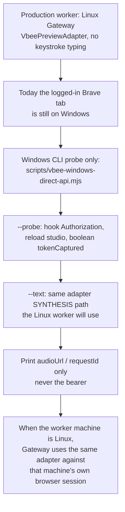

# M2_020 - Windows-Native Vbee Direct API Driver

Milestone: `M2 - Browser CDP Health And Vbee Preview Harness`

Date: 2026-09-14

## Workflow



## Module / Slice Under Test

**Correction:** M2_019's Linux adapter is the production worker path. The upcoming worker machine is Linux. This Windows CLI is not a replacement worker.

Today the only logged-in `studio.vbee.vn` tab is on Windows, and WSL cannot attach to Windows `127.0.0.1:9222` (M2_008). The probe therefore runs on Windows Node so we can prove token capture + SYNTHESIS against a real session *before* that Linux worker box exists. It reuses `VbeePreviewAdapter` instead of a second protocol.

## Approach

```text
Now (live proof, Windows Brave):
  Windows Brave --remote-debugging-port=9222
    -> this CLI
        -> same VbeePreviewAdapter the Linux worker will call
        -> JSON { audioUrl, requestId, tokenCaptured }

Soon (production worker on Linux):
  Linux headed browser, logged-in studio session
    -> Gateway JobRunner
        -> VbeePreviewAdapter (M2_019)
        -> FileService.finalizeFromDownload
```

`--probe` stops after token capture so a first run does not spend preview quota. `--text` is the actual API pump. The script refuses `process.platform !== 'win32'` unless `--force`.

## Files Changed Or Added

- Added: `scripts/vbee-windows-direct-api.mjs`, `scripts/vbee-windows-direct-api.bat`, `scripts/vbee-windows-direct-api.test.js`
- Added: this file, `docs/milestones/M2_020_vbee-windows-direct-api-test-report.md`
- Modified: `docs/README.md`, `docs/milestones/M2_019_direct-api-preview-instead-of-keystrokes.md` (next action)

## Design Patterns Used

- **Linux worker is the target; Windows CLI is a same-box probe.** Do not treat the probe as the production runtime.
- **Reuse the production adapter** from a thin CLI instead of a second protocol implementation.
- **Fail closed on the wrong runtime for this probe** (`win32` check, because today's Brave is on Windows) and on token-shaped output (`sanitizeResult`).

## Verification Commands Or Acceptance Checks

```bash
source ~/.nvm/nvm.sh && nvm use 24
node --check scripts/vbee-windows-direct-api.mjs
node --test scripts/vbee-windows-direct-api.test.js
node scripts/vbee-windows-direct-api.mjs --help
node scripts/vbee-windows-direct-api.mjs --probe
```

Unit tests: **6/6 pass**. `--probe` from WSL exits 2 because this probe is for today's Windows Brave, not because Linux is the wrong worker OS. Live Brave attach was not run here.

On Windows (human):

```bat
cd /d D:\Github\ZeroClaw-Vbee-Automate
scripts\vbee-windows-direct-api.bat --probe
scripts\vbee-windows-direct-api.bat --text "xin chao" --voice <voice_code>
```

## Known Limits

- Windows Node must be on PATH. The `.bat` checks `where node` and does not fall back to WSL.
- Playwright in this repo's `node_modules` was installed from WSL; `connectOverCDP` is JS-only and should work from Windows Node, but that has not been live-checked.
- SYNTHESIS payload `{ text, voice_code, speed }` is still the M2_019 inferred shape.
- This CLI is a live probe, not the Linux worker. When the worker machine is Linux, Gateway should attach to a browser session on that machine and use `VbeePreviewAdapter` directly.

## Next Action

Human can use the `.bat` now to prove the API against today's Windows Brave. The production path remains: Linux worker + headed session on that Linux machine + M2_019 adapter (no keystroke typing).
