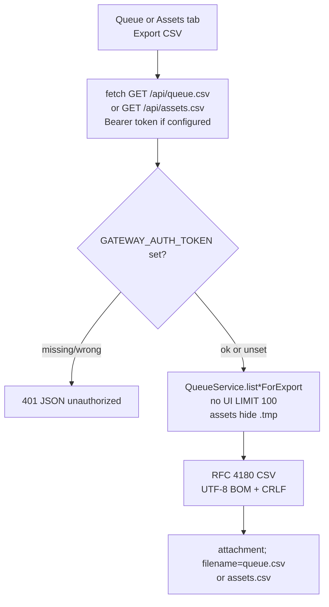

# M2_021 - Queue And Assets CSV Export

Milestone: `M2 - Browser CDP Health And Vbee Preview Harness`

Date: 2026-09-16

## Workflow



## What Was Implemented

Gateway now exports queue jobs and finalized audio assets as CSV through the public HTTP API. The static UI adds an **Export CSV** button on the Queue and Assets panels. Download uses `fetch` plus a blob link so a remote UI can still send `Authorization: Bearer` (the `?token=` query fallback stays scoped to `/api/audio/:filename` only).

CSV encoding:

- RFC 4180 quoting for commas, quotes, and newlines in job text
- UTF-8 BOM so Excel on Windows opens Vietnamese text correctly
- CRLF row separators
- Stable column lists; `file_path` is omitted (homeserver-local, not useful in a spreadsheet)

Export queries are separate from the UI lists: they are not capped at 100 rows. Assets still exclude `*.tmp`, matching `/api/assets`.

## Files Changed Or Added

- `gateway/src/infrastructure/csv.js` (new)
- `gateway/src/infrastructure/csv.test.js` (new)
- `gateway/src/application/queue-service.js` (`listJobsForExport`, `listAssetsForExport`)
- `gateway/src/application/queue-service.test.js` (new)
- `gateway/src/api/http-utils.js` (`sendCsv`)
- `gateway/src/api/routes.js`
- `gateway/src/api/routes.test.js`
- `public/index.html`, `public/app.js`, `public/styles.css`
- this file and `docs/milestones/M2_021_csv-export-test-report.md`

## Design Patterns Used

- **API-only export.** UI does not read SQLite. CSV is another Gateway response, same contract as JSON lists.
- **Separate export queries.** The 100-row UI cap stays for the tables; export is the full current table (minus hidden `.tmp` assets).
- **Declared columns, not `SELECT *` dumped to CSV.** Keeps the spreadsheet stable if extra DB columns appear later.
- **Auth same as other API routes.** No extra `?token=` hole for CSV.

## Verification Commands Or Acceptance Checks

```bash
source ~/.nvm/nvm.sh
nvm use 24
npm run test:m2
```

57/57 tests passed. Live `curl` against a temporary Gateway on port 3011 is recorded in the test report.

UI check without a browser tool: `GET /` HTML contains `exportQueueCsv` and `exportAssetsCsv`. Click-to-download was not exercised in a real browser in this slice.

## Known Limits

- CSV is a snapshot of current SQLite rows, not a live file written into a Syncthing folder.
- Queue export includes pending/failed jobs, not only `done`.
- Very large tables are loaded fully into memory for one response.
- Import CSV (bulk queue from a spreadsheet) is not implemented.
- Stereo timeline export on the Edit tab is unchanged and still disabled.
