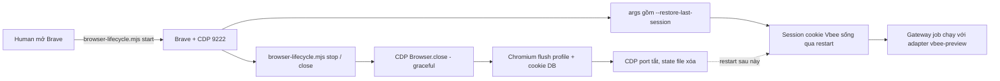

# M2_022 Browser Session Persistence — Tier 2 (Graceful Launch/Close + `--restore-last-session`)

> Current milestone: M2. Slice: Tier 2 của research `X.022` về VBEE login budget
> (nghiên cứu + plan Tier 1–4 ghi ở `.local/VBEE_SESSION_RESEARCH.md`, local-only).

## Workflow



## Vấn đề gốc (tóm tắt từ research)

- Mỗi lần restart Brave → phải login lại Vbee → mỗi login bị VBEE đếm vào quota
  thiết bị (`vượt quá thiết bị đăng nhập`).
- Hai cơ chế Chromium gây mất login: (1) auth cookie Vbee là session cookie và
  Chromium chỉ giữ session cookie qua restart khi bật restore-session;
  (2) force-kill (`/F`, `-9`) làm profile/cookie không kịp flush.

## Đã implement (Tier 2)

Sửa `scripts/browser-lifecycle.mjs` — đây cũng là đường mà Tauri dùng
(`src-tauri/src/gateway_lifecycle.rs` gọi script này), nên desktop cũng được hưởng:

1. **`--restore-last-session` vào launch args** — Chromium giữ session cookie
   qua restart, bớt kịch bản "restart là phải login lại".
2. **`stop` bây giờ đóng MỀM**: thứ tự
   `CDP Browser.close` (native WebSocket tới `webSocketDebuggerUrl`) → fallback
   `taskkill /PID <pid> /T` không `/F` (Windows) hoặc `SIGTERM` (khác) → chờ port
   CDP tắt tối đa `BROWSER_GRACEFUL_CLOSE_TIMEOUT_MS` (8s). Bỏ hẳn `taskkill /F`.
3. **Lệnh `close` mới** — đóng mềm bất kỳ Brave CDP nào (kể cả Brave mở tay /
   external / remote qua `BROWSER_CDP_HOST`), không đòi state "managed".
   Dùng được trên homelab để thay `pkill -f brave-browser`.
4. Không thêm dependency: dùng `WebSocket` global của Node ≥22 (repo yêu cầu ≥24).

## Files changed

```text
scripts/browser-lifecycle.mjs   launch args + stop graceful + lệnh close + timeout config
.local/VBEE_LINUX_HOMELAB_BRAVE.md   (local-only) lệnh mở Brave thêm --restore-last-session,
                                     quy tắc 6-7 đóng sạch, trỏ tới file research
.local/VBEE_SESSION_RESEARCH.md      (local-only) Tier 2 đánh dấu implemented
```

Không đụng `gateway/src/*`, không đụng SQLite, không đụng JobRunner, không thêm package.

## Design pattern

- **Same Ownership Principle giữ nguyên**: `stop` vẫn chỉ đóng browser mà
  lifecycle này đã start (modes `managed`); `close` mới là con dao 2 lưỡi có chủ
  đích ghi rõ "không phân biệt chủ" để phục vụ homelab.
- **Graceful-first**: force-kill là phương án không còn được dùng mặc định, vì nó
  phá cookie flush (source: puppeteer#10666).
- **Native-only deps**: CDP HTTP cho check, WebSocket built-in cho `Browser.close`.

## Verification

```bash
node --check scripts/browser-lifecycle.mjs          # syntax OK
npm run test:m2                                      # 24/24 pass (WSL)
node scripts/browser-lifecycle.mjs close             # live: CDP Browser.close on real Brave
node scripts/browser-lifecycle.mjs start             # live: spawn kèm --restore-last-session
node scripts/browser-lifecycle.mjs status            # live: ok:true, state managed
node scripts/browser-lifecycle.mjs stop              # live: closeMethod:"cdp", port đóng
# context (WSL):
# /home/shinkuro/.venvs/context-mapping/bin/python -u ../context-mapping/cli.py check-consistency .
# -> "OK  Context files consistent."
```

Chi tiết command/result/test-report riêng: `M2_022_browser-session-persistence-test-report.md`.

## Known limits

- `--restore-last-session` khi kết hợp với `config.targetUrl` có thể tích luỹ vài
  tab `studio.vbee.vn` sau nhiều lần restart — vô hại (cùng page), không close tab
  dư tự động (nằm ngoài M2: chưa có page automation).
- `close` chỉ đóng qua CDP; nếu CDP unreachable → trả `not_reachable`, không đụng
  process (đúng chủ đích "không force-kill").
- `build . --quiet` của context-mapping treo >300s trên /mnt/d (scan toàn tree,
  có cả `target/` chạy qua 9P chậm) — vẫn chưa debug được; `check-consistency` pass.

## Plan Tier 3 & Tier 4 (các tier kế tiếp) — PLAN, chưa thực thi

### Tier 3 — Playwright `launch_persistent_context` (đề xuất: tách milestone riêng)

- Mục tiêu: login Vbee đúng 1 lần, các lần sau tái sử dụng đúng profile
  (`user_data_dir=<profile cố định>`), chỉ login lại khi session hết hạn.
- Pattform đã research: `launch_persistent_context(user_data_dir, headless=False)`
  giữ cookies + localStorage + IndexedDB + token; lần đầu headless=False để login
  tay, sau đó headless tuỳ chọn.
- Ảnh hưởng lớn: có thể cần **viết lại đường attach browser** của Gateway hiện tại
  (CDP health + vbee-preview adapter đang giả định browser mở tay với CDP port).
  Không làm vội trong M2, đưa vào roadmap như một option, cần human review vì Vbee
  stealth thích headed.
- Việc nhỏ có thể làm sớm: thư mục `user_data_dir` của Brave (vẫn dùng như bây giờ)
  là tiền đề; track "session còn sống" để chỉ login khi cần.

### Tier 4 — Direct-API token reuse (giảm hẳn nhu cầu login)

- Cơ sở: M2_019/M2_020 đã proof gọi SYNTHESIS trực tiếp bằng bearer token nằm
  trong page context, không cần gõ phím.
- Ý tưởng: login 1 lần mỗi token TTL → tái dùng token cho nhiều job; chỉ mở lại
  browser khi token hết hạn. Giảm số lần login đáng kể → giảm nguy cơ chạm quota
  của VBEE.
- Cần làm: (1) đo TTL của bearer token Vbee; (2) thiết kế lưu trữ token an toàn
  (không commit, không rò vào DB); (3) tách milestone vì có ràng buộc về safe
  handling token và M2_019 đã ghi nguyên tắc "token không rời page context".

## Next action

- Áp Tier 1 (không code) cho homelab: mở Brave kèm `--restore-last-session`,
  đóng bằng `node scripts/browser-lifecycle.mjs close`.
- Quyết định Tier 3 vs Tier 4 trước: đo TTL token (Tier 4) là thử nghiệm nhỏ,
  còn Tier 3 là thay đổi kiến trúc lớn hơn — đề xuất đo TTL trước.