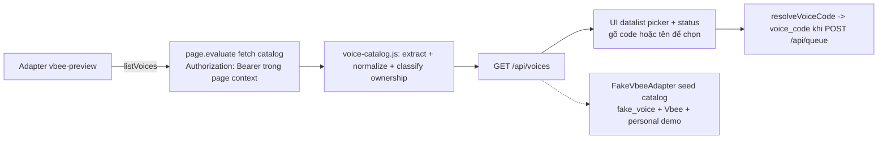

# M2_023 Hybrid Voice Catalog + Picker (API-first, có giọng cá nhân)

> Current milestone: M2. Slice: bước 1–3 của `docs/design/12` — nghiên cứu voice
> selection đã render API-first + hybrid (vừa catalog Vbee vừa giọng cá nhân/
> cộng đồng) được human duyệt.

## Workflow



## Yêu cầu engineering (từ design/12, hybrid)

- Chọn giọng qua **API-first**, không DOM (M2_014 đã bế tắc: không có
  slug→row mapping, click speed bị dialog chặn).
- Catalog phải là **hybrid**: ngoài giọng Vbee còn có **giọng cá nhân / cộng đồng**.
- Token Vbee **không rời page context** (giữ invariant M2_019):
  catalog fetch chạy trong `page.evaluate`, Node chỉ nhận dữ liệu thô.
- Picker phải vẫn cho nhập tay khi catalog chưa cấu hình / chưa capture được.

## Đã implement

### 1. `gateway/src/vbee/catalog/voice-catalog.js` (mới, pure ESM)

Utilities downstream + upstream server:

- **Normalized schema mỗi voice**:
  `{ code, name, gender, language, ownership, sampleUrl, source }`.
- `ownership` chuẩn hoá thành `'vbee' | 'personal' | 'community' | 'unknown'`
  (`classifyOwnership`); không có field ownership → mặc định `'vbee'`
  (nội dung chính catalog của provider); `is_personal: true` → `'personal'`.
- `extractVoicesArray(payload, arrayField)`: đường dẫn dot-explicit
  (`result.voices`) hoặc auto-detect (array top-level / dưới `result|data|...`).
- `normalizeVoices(raw, { source, fields })`: auto-detect code/name/gender/
  language/ownership/sample; có `fields` để map theo shape lạ.
- `mergeVoiceCatalogs(...)`: union theo `code`, nâng cấp voice `unknown`
  nếu catalog sau có ownership rõ hơn (chuẩn bị merge lane studio + official M4).
- Nhận diện giọng nữ/nam (Nữ/nu/female..., Nam/nam/male..., dấu tiếng Việt OK).

### 2. Adapter contract mở rộng: `listVoices()`

- **FakeVbeeAdapter** (`fake-vbee.js`): trả seed catalog — `fake_voice`
  (giữ back-compat default UI), 3 giọng Vbee fake có code giống shape Vbee thật
  (`hn_female_ngochuyen_full_48k-fhg`...), 1 giọng `personal`.
- **VbeePreviewAdapter** (`vbee-preview.js`):
  - `voicesUrl` (`VBEE_VOICES_URL`) + `catalogArrayField`
    (`VBEE_VOICES_ARRAY_FIELD`) cấu hình từ `config.runtime.voiceCatalog`.
  - Chưa cấu hình URL → trả `{ok, source, voices: [], warning}` không throw.
  - Có URL → `installTokenCapture → ensureStudioPage → extractSessionToken`
    (bộ bước M2_019) rồi `defaultFetchCatalogFromPage`: `page.evaluate`
    fetch URL kèm `Authorization: Bearer <window.__vbeeToken>` (token không
    bao giờ đi qua Node), parse thô, rồi Node-side normalize.
  - **Degrade-don't-throw**: session/network/HTTP lỗi → `{ok:true, voices:[],
    warning}` để Gateway không crash và UI có thể fallback nhập tay.
  - **Cache TTL 5 phút** trong adapter (singleton nên dùng được cho nhiều job).

### 3. Gateway wiring

- `config.js`: `runtime.voiceCatalog = { url, arrayField }` từ env
  (gom trong `runtime` nên `/health` echo được, không có secret).
- `server.js`: `createVbeeAdapter` truyền `voicesUrl`/`catalogArrayField`
  vào VbeePreviewAdapter; router nhận `vbeeAdapter`.
- `routes.js`: **`GET /api/voices`** → `{ok, source, fetchedAt, voices, warning}`.
  Không auth-exempt (đồng bộ `/api/queue`); khi chưa wire adapter → default
  rỗng an toàn.

### 4. Dev client picker

- `index.html`: `#voiceCode` thành input **+ `<datalist id="voiceList">`**
  (giữ được nhập tay khi catalog rỗng) + hint `#voiceCatalogStatus`.
- `app.js`:
  - `loadVoiceCatalog()` trong `refreshAll` → `renderVoiceCatalog()` điền
    datalist (label `Tên — Vbee / Cá nhân / Cộng đồng`) + status
    (`Voice catalog: 42 giọng (Vbee 39 · Cá nhân 3)`) hoặc warning.
  - `resolveVoiceCode(value)`: nhập code → code; nhập đúng **tên** → code;
    còn lại giữ nguyên (cho phép tự do).
  - `POST /api/queue` dùng `voice_code: resolveVoiceCode(...)`.
- `styles.css`: thêm `.hint` cho status catalog.

## Files changed / added

```text
gateway/src/vbee/catalog/voice-catalog.js          (mới) normalize/classify/merge/extract
gateway/src/vbee/catalog/voice-catalog.test.js     (mới) 10 tests
gateway/src/vbee/adapters/fake-vbee.js             listVoices() seed catalog
gateway/src/vbee/adapters/vbee-preview.js          listVoices() page-context fetch + cache
gateway/src/vbee/adapters/fake-vbee.test.js        + listVoices test
gateway/src/vbee/adapters/vbee-preview.test.js     + 5 listVoices tests
gateway/src/config.js                              runtime.voiceCatalog {url, arrayField}
gateway/src/server.js                              wire voicesUrl + vbeeAdapter -> router
gateway/src/api/routes.js                          GET /api/voices
gateway/src/api/routes.test.js                     + 3 routes tests
public/index.html / public/styles.css / public/app.js   datalist picker + status + resolver
docs/milestones/M2_023_voice-catalog-hybrid-picker.md    (this doc)
docs/milestones/M2_023_voice-catalog-test-report.md      test report
```

## Design pattern

- **Provider adapter contract mở rộng** theo `TTS_PROVIDER_ADAPTERS.md`:
  `listVoices()` là contract mới cạnh `synthesize()`, normalized shape chung
  cho mọi provider — chuẩn bị merge lane official M4.
- **Page-context confinement** (giữ M2_019): token chỉ đọc trong page,
  body dữ liệu được `redactSensitiveFields` chặn token-shape trước khi ra Node.
- **Degrade-don't-throw**: catalog là tính năng phụ trợ, không được làm crash
  gateway hoặc chặn luồng queue hiện có; failure → warning hiển thị trên UI.
- **Auto-detect + env overrides**: endpoint/shape studio chưa biết → code
  tự nhận dạng field phổ biến, `VBEE_VOICES_ARRAY_FIELD` để chỉnh khi đã có
  capture live.

## Verification

```bash
# WSL
node --test 'gateway/src/**/*.test.js'      # 77/77 pass (WSL, node 24)
node --check gateway/src/**/*.test.js ...    # ALL_SYNTAX_OK
# context (WSL)
PYTHONUNBUFFERED=1 /home/shinkuro/.venvs/context-mapping/bin/python -u \
  ../context-mapping/cli.py check-consistency .   # OK Context files consistent
```

## Known limits

- **Endpoint catalog studio chưa biết shape thật** — chưa capture live
  (human-gated): `VBEE_VOICES_URL` mặc định rỗng → khi `VBEE_ADAPTER=vbee-preview`
  catalog trả warning, UI fallback nhập tay. Khi bắt được capture, chỉ cần set
  env (và thêm/correct test) — không sửa code core.
- Live accept của `{voice_code, speed}` qua WS SYNTHESIS vẫn chưa verify
  (handover từ M2_019); fake/picked code vẫn đi qua nền tảng cũ.
- Datalist là picker tối giản: không preview audio theo giọng, không phân trang,
  không lưu lịch chọn gần nhất.
- Health endpoint chưa expose trạng thái catalog (`source/warning`) — chưa cần
  cho M2.
- Lần merge với catalog official API (M4) chưa chạy trên data thật.

## Next action

1. (Human-gated) Capture live endpoint catalog studio trên homelab → set
   `VBEE_VOICES_URL` + `VBEE_VOICES_ARRAY_FIELD` trong profile, kiểm tra
   `/api/voices` trả giọng thật (gồm giọng cá nhân).
2. Verify live một job với `voice_code` chọn từ picker qua `vbee-preview`.
3. M4 khi có official token: adapter official + `mergeVoiceCatalogs`
   (`GET /api/v1/voices`, `POST /api/v1/tts` theo design/12) → thêm lane
   nguồn thứ 2.